# `amps-connectors`

A **multi-source connector framework** — raw framed TCP feeds, Kafka topics, database queries
and Hazelcast topics — that decodes, filters, reshapes, keys and publishes records into
[60East AMPS](https://www.crankuptheamps.com/) topics, plus the **Spring Boot applications**
built on it. One application runs one or more connectors; everything is driven from
configuration.

The transport is one block in the connector's configuration. Everything after it — decoding,
the filter, the transforms, the key, the encoder, batching and the publish — is shared, so a
Kafka connector and a socket connector differ by the six lines under `source:`.

This is the module to read when the question is *how does something that is not AMPS become a
SOW record*: the answer involves a key that one of two ends computes, a delete that is
sometimes a filter and sometimes a key, and a batch whose flush is what makes an
acknowledgment honest.

---

## Layout: framework, drivers, applications

```
amps-connectors/
├── core/             :amps-connectors:core — the pipeline as a java-library
│                     (decode → filter → transform → key → encode → batch → publish)
│                     + the source SPI + the config model and validator +
│                     auto-configuration + test fixtures. Knows no transport.
├── source-tcp/       :amps-connectors:source-tcp — the framed-socket driver (java.net)
├── source-kafka/     :amps-connectors:source-kafka — the Kafka consumer driver
├── source-jdbc/      :amps-connectors:source-jdbc — the polled-query driver (java.sql)
├── source-hazelcast/ :amps-connectors:source-hazelcast — the Hazelcast client driver
│                     Each carries its own client and registers a SourceFactory; an
│                     application depends on the transports it actually dials.
├── connector-app/    :amps-connectors:connector-app — the GENERIC runner, which depends
│                     on ALL FOUR drivers. One image, deployed N times: a config-only
│                     application is this app under its own name with its own mounted
│                     configuration.
├── apps/             custom-code applications (auto-discovered by settings.gradle.kts);
│                     the escape hatch when an app needs its own transform bean or an
│                     unusual driver. See apps/README.md. Empty is the normal state.
├── config/           the DEPLOYABLE applications: config/<env>/<flow>/<app-name>/
│   ├── local/        one directory per application; `common/` per env for the shared
│   │   ├── common/   AMPS endpoint. Adding application #51 = mkdir + one application.yml.
│   │   ├── streams/{ticks-tcp,orders-kafka}/
│   │   ├── db/{positions-jdbc}/
│   │   └── cache/{events-hazelcast}/
│   └── dev/common/   the same shape, pointed at the dev servers
├── docker/           ONE shared spring-boot.Containerfile for every app image
└── scripts/          amps-connectors-compose.sh — generates + drives podman compose
                      from the config tree
```

Configuration layers, later sources winning (**the jar knows no environment**):
baked [`application.yml`](connector-app/src/main/resources/application.yml) (safe defaults, no
connectors) → `config/<env>/common/` → `config/<env>/<flow>/<app-name>/`, the mounted pair
arriving as `SPRING_CONFIG_ADDITIONAL_LOCATION=file:/app/config/common/,file:/app/config/instance/`.
Endpoints are `${AMPS_HOST:localhost}`-style placeholders (`AMPS_PORT`, `KAFKA_HOST`,
`TCP_HOST`, `JDBC_HOST`, `HAZELCAST_HOST` likewise) so the same files serve IDE runs and
containers. Never define `amps-connectors.connectors` in `common/` — two lists merge **by
index** — and never bake one; `ConfigTreeTest` enforces the tree's rules (every instance binds
and validates, names exactly one transport, no two apps in an environment share a connector
name, no credential literals) without booting anything. A **credential key** — anything named
`…password…`, `…secret…`, `…token…` — may carry a single `${VAR:}` placeholder and nothing
else: the name of a secret is safe in git, the secret is not.

The topics these applications publish into are a flow of their own:
[`server/config/flows/amps-connectors/amps-config.xml`](../server/config/flows/amps-connectors/amps-config.xml).

---

## Architecture and data flow

One connector = one upstream feed = one AMPS topic. Everything between the two ends is
transport- and format-agnostic: the source only decides what a record *is*, the format only
decides how a payload becomes `field → value`, and the target block only decides what AMPS is
asked to do with it — so any source can feed any format can feed any topic shape.

```mermaid
flowchart LR
    subgraph SRC["source: — exactly one of tcp / kafka / jdbc / hazelcast"]
        direction TB
        STATE["STATEFUL feed (jdbc.mode=SNAPSHOT, a compacted<br/>Kafka topic, a reliable Hazelcast topic from OLDEST)<br/>state, or a log that can be replayed into state:<br/>the whole query re-run (a vanished key DELETES),<br/>a tombstone (null value → DELETE), a ringbuffer<br/>replayed from its oldest retained message"]
        STREAM["STREAMING feed (a socket, an INCREMENTAL query,<br/>a plain Hazelcast topic)<br/>a log, and often not even that: a socket replays<br/>nothing at all and never deletes"]
    end

    SUB["RecordSource → SourceRecord(data, key, UPSERT / DELETE, ack)<br/>TcpRecordSource (LISTEN binds and accepts N feeds;<br/>CONNECT redials) · KafkaRecordSource (group offsets<br/>committed only for ACKNOWLEDGED records) ·<br/>JdbcRecordSource (polls; rows → JSON; a key that<br/>stopped appearing → DELETE) · HazelcastRecordSource<br/>(client, plain or reliable topic) · SimulatedSource<br/>(driver: SIMULATED — the demo profile)"]

    DEC["RecordDecoder — format:<br/>JSON (nesting and types kept: a price stays a<br/>BigDecimal, so 185.50 survives) · FIX / NVFIX<br/>(tag=value on field-separator; a repeated tag<br/>becomes tag#2, so groups survive) · TEXT<br/>malformed input → IllegalArgumentException → rejected"]

    FLT["RecordFilter — filter:<br/>declarative rules (equals/not-equals/in/matches/<br/>gt/gte/lt/lte/present, combined ALL or ANY)<br/>AND an optional SpEL expression over #f<br/>a DELETE with an empty body SKIPS the filter"]

    TRF["TransformChain — transforms:<br/>keep · drop · rename · set · values · derive (SpEL,<br/>typed result) · bean (a RecordTransform from the app)<br/>in order; null drops the record<br/>any transform at all disables passthrough"]

    KEY["KeyExtractor — amps.key:<br/>SERVER: check the key fields are present, send no SowKey<br/>PUBLISHER: join the key fields (or take the source's<br/>own key) and send it as the SowKey<br/>undeterminable → rejected, never published unkeyed"]

    ENC["PayloadEncoder — amps.message-type:<br/>json / fix / nvfix, chosen by the TARGET not the source<br/>passthrough AUTO: the original bytes when the formats<br/>match and nothing touched the record"]

    BAT["Spring Integration aggregator + BatchPublisher<br/>release by amps.batch.max-messages (on the SOURCE<br/>thread — the back-pressure) or flush-interval<br/>(on the scheduler — the quiet feed's insurance)<br/>every command in order, then ONE flush"]

    PUB["HaAmpsPublisher — one HAClient per connector<br/>URI tcp://host:port/amps/&lt;message-type&gt;<br/>publish store replays what a reconnect left in doubt"]

    subgraph TGT["the AMPS topic — amps.topic + amps.command"]
        direction TB
        KEYED["SOW topic WITH a &lt;Key&gt; — key.mode: SERVER<br/>the server derives the key from the payload<br/>delete = sow_delete by a FILTER over the key fields"]
        UNKEYED["SOW topic WITHOUT a &lt;Key&gt; — key.mode: PUBLISHER<br/>the SowKey header is the key<br/>delete = sow_delete by that key"]
        JRN["journal-only topic — no key at all<br/>every record appended; on-delete: IGNORE<br/>read back with a bookmark subscription"]
    end

    STATE --> SUB
    STREAM --> SUB
    SUB --> DEC --> FLT --> TRF --> KEY --> ENC --> BAT --> PUB
    PUB --> KEYED
    PUB --> UNKEYED
    PUB --> JRN
    BAT -. "flush succeeded → record.acknowledge()" .-> SUB
```



Reading the two ends against each other:

- **Any source can feed any format can feed any topic shape.** The middle of the pipeline never
  asks which transport delivered the record or which topic will receive it.
- **`format` and `message-type` are different questions.** `format` is what the source's bytes
  *are*; `message-type` is what AMPS is told they are — and it also picks the client URI, so a
  FIX connector and a JSON connector in one application hold two connections. A connector that
  reads FIX and publishes `json` is exactly the translation this framework exists to do.
- **Removal only exists where there is a SOW**, which is why `on-delete: IGNORE` is the honest
  setting for a journal topic rather than a default nobody reads.
- **The acknowledgment travels backwards.** It is the batch's flush, not the publish, that
  tells a source a record is safe — which is why Kafka's offsets and a JDBC watermark move on
  a batch boundary and not a record boundary.

## The pipeline, stage by stage

| stage | configured by | what it does | what a failure counts as |
|---|---|---|---|
| decode | `format`, `field-separator` | payload → ordered `Map<String, Object>`, nesting and types intact | `rejected` |
| filter | `filter:` | rules (ALL/ANY) **and** a SpEL expression; addresses fields as the *source* names them | `filtered` |
| transform | `transforms:` | `keep` `drop` `rename` `set` `values` `derive` `bean`, in order; `null` drops the record | `dropped` |
| key | `amps.key` | SERVER: check; PUBLISHER: build the SowKey — or refuse | `rejected` |
| encode | `amps.message-type`, `passthrough` | field map → json/fix/nvfix, or the original bytes unchanged | `rejected` |
| batch | `amps.batch` | accumulate, release by size or idle time, one flush per batch | `failed` batches |

Five counters rather than one, because "the topic has fewer records than the feed" has five
different causes and they need telling apart. They are what the status line prints:

```
connector status:
  ticks-tcp                RUNNING   connectors/ticks             received=8120 published=8120 batches=17 failed=0 rejected=0 filtered=0 dropped=0 ignored-deletes=0
  orders-kafka             RUNNING   sow/connectors/orders        received=412 published=380 batches=9 failed=0 rejected=0 filtered=32 dropped=0 ignored-deletes=0
```

## Batching and the acknowledgment contract

A connector does not publish records, it publishes **batches**, and the batch is also the unit
of durability:

1. Each record the pipeline accepts is sent into a `DirectChannel`, so the **source's own
   thread** carries it through decode, filter, transforms, key and encode.
2. A Spring Integration **aggregator** holds the results. It releases when
   `amps.batch.max-messages` have accumulated — on that same source thread, which is where the
   back-pressure comes from: a source that outruns AMPS ends up waiting in its own reader loop
   instead of growing a queue — or when `amps.batch.flush-interval` of idle time passes, on the
   scheduler, so a quiet feed's last record does not sit unsent.
3. `BatchPublisher` issues every command of the batch in order (publish, delta_publish,
   sow_delete — order is preserved, because a delete and the publish beside it are not
   commutative), and then waits **once** on `publishFlush` for `amps.flush-timeout`.
4. **Only if that flush returns** does it call `acknowledge()` on every record in the batch.
5. Stopping a connector closes the source, then forces the aggregator's partial batch out
   *synchronously*, then unregisters the flow, then disconnects. Reversed, the last few records
   the source had already read would be dropped on the floor at every shutdown.

What an acknowledgment means is the source's business: **Kafka** commits offsets from its poll
thread for acknowledged records only (`enable.auto.commit=false`), and **JDBC INCREMENTAL**
persists its watermark. TCP and Hazelcast have nothing to acknowledge to, so their records
carry no ack at all.

The contract is **at-least-once**. A crash between a publish and its flush re-reads those
records; a flush that times out is not data loss either — the HAClient's publish store still
holds everything unacknowledged and replays it after a reconnect — it only means the batch's
records are not acknowledged *yet*. Duplicates are harmless on a keyed topic (the second
publish is the same upsert) and visible on a journal topic, which is the trade a journal topic
makes anyway.

`publish-store: MEMORY` survives a reconnect, `FILE` survives a restart for the price of a
synchronous write per publish, and `NONE` turns the whole thing off and makes the connector
fire-and-forget.

## The two key modes, and the trap one of them exists to avoid

AMPS will not let both ends decide a record's identity, so `amps.key.mode` has to agree with
the topic's definition in the server flow:

| | `mode: SERVER` | `mode: PUBLISHER` |
|---|---|---|
| the topic is declared | **with** a `<Key>` (`<Key>/11</Key>`) | **without** a `<Key>` |
| who computes the key | AMPS, from the payload | the connector, as the SowKey header |
| `key.fields` | required — the fields to **check** | the fields to **join**; empty means "use the source's own key" |
| a record missing them | rejected (AMPS could not key it) | rejected (there is no SowKey to send) |
| a delete | `sow_delete` by a **filter** built from the key fields (`/account = 'ACC-1' AND /symbol = 'AAPL'`) | `sow_delete` by that **key** |

**The trap.** AMPS does *not* reject a publish that carries no SowKey onto a SOW topic declared
without a `<Key>`. Measured against 5.3.5.135: the record is filed under a sentinel key
(`18446744073709551615`) and **every subsequent keyless publish overwrites that same record**.
A whole feed can therefore collapse onto one SOW row while every log line and every counter
says the connector is healthy, and nothing downstream can tell. So it is refused at both ends:
`ConnectorValidator` will not accept PUBLISHER mode unless `key.fields` or a key-bearing source
(kafka, or jdbc with `key-columns`) can supply a key, and at runtime `KeyExtractor` throws
rather than publishing unkeyed — the record is counted as `rejected` and never sent.

The mirror-image mistake belongs to SERVER mode and is just as quiet: a payload AMPS cannot
parse. A FIX connector with `field-separator: "|"` publishes pipe-delimited FIX, because the
connector's separator serves both ends — and AMPS's `fix` parser expects SOH, so a topic keyed
`/11` gets nothing it recognises. Measured on 5.3.5.135, the publish is **accepted**, the record
is filed under a key derived from nothing useful, and no `/11` filter ever matches it again.
Read pipes if the feed writes them, by all means, but then publish `json`, or re-encode to SOH.

**Deletes.** `amps.on-delete` is `SOW_DELETE` or `IGNORE`. A DELETE record whose payload is
empty *skips the filter* — a Kafka tombstone carries no fields, so any rule at all would refuse
it and the record it was meant to remove would live forever — but it still goes through the
transforms, because its key fields come out of the same namespace an upsert's do. A delete that
cannot be addressed (no key, no usable filter) is counted as `ignored-deletes` and dropped, not
guessed at. `IGNORE` is the right setting for a journal topic, where there is nothing to remove
from.

## Configuration reference

The worked, commented examples are
[`application-demo.yml`](connector-app/src/main/resources/application-demo.yml) (four
connectors, one per transport, all simulated) and the deployable applications under
[`config/local/`](config/local). The shapes:

### The application

```yaml
amps-connectors:
  enabled: true                    # false starts the process with no connectors running
  status-interval: 60s             # how often each connector logs its counters
  amps:                            # ONE server block, shared by every connector
    host: ${AMPS_HOST:localhost}
    port: ${AMPS_PORT:9007}
    transport: tcp                 # tcp | tcps
    client-name-prefix: amps-connectors   # client name = "<prefix>-<connector name>"
    logon-timeout: 10s
    reconnect-delay: 5s            # HAClient reconnect backoff
    publish-store: MEMORY          # MEMORY | FILE | NONE
    publish-store-dir: build/client-state/amps-connectors   # FILE only
    flush-timeout: 10s             # how long a batch waits for the persisted ack
    publish-batch-bytes: 0         # >0 → client-side coalescing (setPublishBatching)
    publish-batch-delay: 10ms
  connectors: []                   # the list an instance file owns; NEVER in common/
```

One server block, but **one client per connector**: the message type is part of the connection
URI (`/amps/fix` vs `/amps/json`), so a FIX connector and a JSON connector cannot share one
however much they share a server. The client *name* matters too — it is the identity AMPS and
the publish store use to correlate a publisher across runs, so it comes from configuration
rather than from a generated id.

### A connector

```yaml
    - name: orders-kafka           # unique: it is the AMPS client name and the flow id
      enabled: true
      format: FIX                  # JSON | FIX | NVFIX | TEXT — what the SOURCE sends
      field-separator: "|"         # FIX/NVFIX only; default SOH. Read the note above first
      source: { ... }              # driver + EXACTLY ONE transport block
      filter: { ... }              # optional
      transforms: [ ... ]          # optional, in order
      amps: { ... }                # topic, message type, key, deletes, batching
```

### `source:` — one transport block, and the simulator

```yaml
      source:
        driver: ${source-driver:REAL}     # REAL | SIMULATED (the in-process generator)
        simulated:                        # SIMULATED only; the block below is still required
          rate: 20                        # records per second
          keys: 25                        # distinct keys to cycle, so a keyed topic converges
          template: "35=D|11=ORD-{{key}}|38={{seq}}|60={{ts}}"
        tcp:                              # ── a framed socket ──────────────────────────
          mode: LISTEN                    # LISTEN (bind, accept N feeds) | CONNECT (dial, redial)
          host: 0.0.0.0                   # LISTEN: the bind address; CONNECT: the peer
          port: 5001
          framing: DELIMITED              # DELIMITED | LENGTH_PREFIXED (4-byte big-endian)
          delimiter: "\n"                 # the YAML escape, never the byte itself
          charset: UTF-8
          connect-timeout: 5s
          reconnect-delay: 5s
        kafka:                            # ── a Kafka topic ────────────────────────────
          bootstrap-servers: "${KAFKA_HOST:localhost}:9092"
          topic: orders.fix
          group-id: amps-connectors-orders   # required: the group IS this connector's position
          from: EARLIEST                  # EARLIEST | LATEST, for a group with no offset
          poll-timeout: 500ms
          max-poll-records: 500
          reconnect-delay: 5s
          properties: {}                  # raw consumer properties, applied last
        jdbc:                             # ── a polled query (format: JSON required) ───
          url: "jdbc:postgresql://${JDBC_HOST:localhost}:5432/trading"
          username: trading_ro
          password: "${JDBC_PASSWORD:}"   # a placeholder and nothing else, ever
          query: "SELECT account, symbol, quantity FROM positions"   # run verbatim
          mode: SNAPSHOT                  # SNAPSHOT (state) | INCREMENTAL (a journal)
          key-columns: [account, symbol]  # SNAPSHOT: what makes a vanished row a DELETE
          key-separator: "|"
          # incremental-column: updated_at    # INCREMENTAL only: the forward-reading mark
          # state-file: /app/state/positions  # INCREMENTAL only: the watermark, persisted on ack
          poll-interval: 5s
          reconnect-delay: 5s
          fetch-size: 1000
        hazelcast:                        # ── a Hazelcast topic (always a CLIENT) ──────
          cluster-name: dev
          members: [ "${HAZELCAST_HOST:localhost}:5701" ]
          topic: connector.events
          reliable: true                  # ringbuffer-backed, so there is something to replay
          reliable-from: OLDEST           # NEWEST | OLDEST (reliable only)
          connection-timeout: 5s
          reconnect-delay: 5s
```

`driver: SIMULATED` keeps the transport block: it says what the connector stands in for, the
validator's transport rules go on applying, and the demo therefore cannot validate a
configuration the real deployment would reject. The template's placeholders are `{{key}}`
(cycling `K-<n>`), `{{seq}}` (a counter) and `{{ts}}` (an ISO-8601 instant); a FIX or NVFIX
template writes `|` between its fields and the generator swaps it for the connector's own
`field-separator`, because a literal SOH does not survive a YAML file.

A **JDBC** row has no wire format, so the source synthesises one — a flat JSON object keyed by
result-set column *label*, aliases included, numbers left as numbers — which is why
`format: JSON` is required there. A **Kafka** null value is a tombstone and becomes a DELETE;
the message key becomes the record's key. **TCP** frames carry no key and never delete.

### `filter:` and `transforms:`

```yaml
      filter:                             # a record passes when the rules agree AND the
        match: ALL                        # expression is true. ALL | ANY
        rules:                            # each rule names EXACTLY ONE operator
          - { field: "35", in: [D, G, F] }
          - { field: "38", gt: 0 }        # gt gte lt lte: numeric; a non-numeric value is false
          - { field: "55", matches: "^[A-Z]{1,5}$" }
          - { field: "1", present: true }
          - { field: "54", equals: "1" }  # equals | not-equals
        expression: "#f['35'] == 'D' && #num(#f['38']) > 100"   # SpEL over the field map

      transforms:                         # each step sets EXACTLY ONE kind, applied in order
        - keep: [ "11", "55", "54", "38" ]   # projection; must include every key field
        - drop: [ "10" ]
        - rename: { "55": symbol }
        - set: { source: kafka }
        - values: { "54": { "1": BUY, "2": SELL } }   # unknown codes pass through
        - derive: { notional: "#num(#f['38']) * #num(#f['44'])" }   # typed SpEL result
        - bean: myEnricher                # a RecordTransform bean from an app under apps/
```

One operator per rule and one kind per step, on purpose: a `rename` before a `keep` and a
`keep` before a `rename` are different programs, and merging them would leave which ran first
up to a field-declaration order nobody can see. Both are checked at startup, along with every
regular expression and every SpEL expression — a syntax error is a startup failure, not a
per-record surprise.

### `amps:` — the target

```yaml
      amps:
        topic: sow/connectors/orders      # must exist in the server's flow configuration
        message-type: fix                 # json | fix | nvfix — the encoder AND the URI
        command: PUBLISH                  # PUBLISH | DELTA_PUBLISH (needs a key)
        key:
          fields: [ "11" ]                # SERVER: the fields to check. PUBLISHER: to join
          separator: "|"
          mode: SERVER                    # SERVER | PUBLISHER — see the table above
        on-delete: SOW_DELETE             # SOW_DELETE | IGNORE
        passthrough: AUTO                 # AUTO | ALWAYS | NEVER
        batch:
          max-messages: 500               # a full batch publishes on the source thread
          flush-interval: 250ms           # a partial batch publishes on the scheduler
```

`passthrough: AUTO` publishes the **original payload bytes** when the source format matches the
message type and no transform touched the record — the record reaches AMPS byte for byte as the
feed wrote it. Decoding still happens (the filter, the key and the counters need the fields);
only the re-encoding is skipped. Any transform at all turns it off: once the field map has been
edited, the original bytes are no longer what the connector means to publish.

## Run

Start the server flow these topics live in, then the demo profile — four connectors, one per
transport, every source swapped for the in-process simulator, so the whole pipeline runs
against nothing but AMPS:

```bash
AMPS_FLOW=amps-connectors ./server/scripts/amps.sh start
./gradlew :amps-connectors:connector-app:bootRun --args="--spring.profiles.active=demo"
```

A deployable application from the config tree, from the IDE or the CLI (endpoints default to
`localhost`; the bare app with no extra configuration boots idle with zero connectors):

```bash
./gradlew :amps-connectors:connector-app:bootRun --args="--spring.config.additional-location=file:amps-connectors/config/local/common/,file:amps-connectors/config/local/streams/ticks-tcp/"
```

That one binds port 5001 and waits to be fed, which is what `tcp.mode: LISTEN` means:

```bash
nc localhost 5001
{"symbol":"AAPL","bid":185.25,"ask":185.30,"last":185.28,"size":100,"tickTime":"2026-09-19T14:00:00Z"}
```

Watch the records arrive with this repo's own tools — `connectors/ticks` is journal-only, so
the transaction log is the only place to look:

```bash
utils/bin/ampsToFileTxLog.sh --topic connectors/ticks --out /tmp/ticks.jsonl
utils/bin/ampsToFileSOW.sh   --topic sow/connectors/positions --out /tmp/positions.json
```

Any setting can be overridden on the command line, e.g. an AMPS on another host:

```bash
./gradlew :amps-connectors:connector-app:bootRun --args="--spring.profiles.active=demo --amps-connectors.amps.host=amps-1"
```

### The fleet, under podman

[`scripts/amps-connectors-compose.sh`](scripts/amps-connectors-compose.sh) generates a compose
file from `config/<env>/` — one service per application directory, each flow a compose profile
— and drives `podman compose` with it:

```bash
amps-connectors/scripts/amps-connectors-compose.sh local build          # gradle → podman images
amps-connectors/scripts/amps-connectors-compose.sh local up streams     # the tcp + kafka apps
amps-connectors/scripts/amps-connectors-compose.sh local up db          # the jdbc app
amps-connectors/scripts/amps-connectors-compose.sh local up cache       # the hazelcast app
amps-connectors/scripts/amps-connectors-compose.sh local up             # every flow
amps-connectors/scripts/amps-connectors-compose.sh local ps
amps-connectors/scripts/amps-connectors-compose.sh local logs ticks-tcp
amps-connectors/scripts/amps-connectors-compose.sh local down
```

Services publish no ports — connectors are outbound clients and the actuator healthcheck runs
inside the container network — with one exception: a connector in `tcp.mode: LISTEN` is dialled
*by* its feed, so `TCP_LISTEN_PORT=5001` publishes that app's port. They reach AMPS and their
sources on the host through `host.containers.internal`; override with `AMPS_HOST`, `AMPS_PORT`,
`KAFKA_HOST`, `TCP_HOST`, `JDBC_HOST` or `HAZELCAST_HOST`. Config-only apps run
`localhost/amps-connector-app:local`; an app with a module under `apps/<name>/` runs
`localhost/amps-<name>:local` instead. All of them are the same
[`docker/spring-boot.Containerfile`](docker/spring-boot.Containerfile), because the build
context is generic: `application.jar` plus that file, and the configuration arrives as mounts.

## Test

```bash
./gradlew :amps-connectors:core:test :amps-connectors:source-tcp:test \
          :amps-connectors:source-kafka:test :amps-connectors:source-jdbc:test \
          :amps-connectors:source-hazelcast:test :amps-connectors:connector-app:test
```

No broker, no database, no Hazelcast cluster and no AMPS server required: Kafka drives a
`MockConsumer`, TCP a loopback `ServerSocket` the test starts itself, JDBC a real in-memory H2
database, Hazelcast an embedded member in the test JVM, and the pipeline a `FakeRecordSource`
plus a `RecordingAmpsPublisher`. `connector-app`'s suite is the configuration one: the shipped
demo examples in `ApplicationYamlBindingTest`, the whole `config/` tree in `ConfigTreeTest`.

Against a real AMPS, in a throwaway container:

```bash
AMPS_IMAGE=localhost/amps-demo:5.3.5.135 ./gradlew :amps-connectors:connector-app:integrationTest
```

`TcpToAmpsIT` runs the real application with four socket connectors and reads AMPS back with a
plain client: PUBLISHER keys land as the SowKey (asserted on `getSowKey()`, because the sentinel
collapse looks *fine* from the connector's side), a filtered line and a malformed one leave the
SOW alone while the feed carries on, a journal topic replays every record from the `epoch`
bookmark, and a FIX `35=G` replaces the record its `35=D` created. `JdbcToAmpsIT` polls an H2
table and watches an insert, an update and — the one that is not a message at all — a **delete**
reach the SOW. Both skip rather than fail when `AMPS_IMAGE` is unset, so a green build is not by
itself proof they ran: check for `SKIPPED` if it matters.

## Why Spring Integration, and only for the pipeline

The sources are **plain threads**. A `RecordSource` is a class with `start(handler)`,
`isConnected()` and `close()`, and every driver's test starts one against a loopback socket, a
`MockConsumer`, an H2 database or an embedded Hazelcast member with no application context
anywhere. That is deliberate: the drivers are where the fiddly protocol work lives, and making
them testable in milliseconds without Spring is worth more than the uniformity of turning them
into inbound channel adapters.

Spring Integration earns its place for exactly one job — the **batch**:

- an **aggregator** already does size-or-time release correctly, including the partial batch on
  expiry, which is the piece that is easy to write and easy to get subtly wrong;
- a **`DirectChannel`** hands the record to the pipeline on the *source's own thread*, so a full
  batch publishes there too and a source that outruns AMPS back-pressures itself instead of
  growing an unbounded queue;
- keeping the aggregator's `SimpleMessageStore` gives `stop()` a **forced release**
  (`expireMessageGroups(0)`), which is how the last partial batch reaches AMPS at shutdown
  rather than being dropped;
- flows are registered at runtime through `IntegrationFlowContext` under the connector's name,
  so connectors stay **config-driven** — fifty connectors are fifty registrations, not fifty
  beans.

The pipeline itself (`RecordPipeline`) is a plain function — `SourceRecord` in, `PublishRequest`
or `null` out — so everything interesting about decoding, filtering, transforming and keying is
unit-tested with no framework at all.

**Swapping the `DirectChannel` for a `QueueChannel`** is the one change to reach for if a source
must never block: put a bounded `QueueChannel` in front of the aggregator, give the flow a
`PollerMetadata` (a poller with a receive timeout and a task executor), and the publish moves
off the source thread onto the poller's. The costs are the reason it is not the default —
back-pressure becomes a queue depth and a rejection policy rather than a blocked reader, the
ordering guarantee weakens the moment the poller has more than one thread, and records sitting
in the queue at a crash are unacknowledged *and* unpublished, which is a second place to reason
about at-least-once. For a connector whose source can replay, blocking the reader is the
simpler correct answer.

## Custom applications

An application that needs **code** — a `RecordTransform` bean named by a `transforms: [ { bean:
… } ]` step, a decoder for a format nobody else speaks, a JDBC driver other than the blessed one
— gets its own module under [`apps/`](apps/README.md). The root `settings.gradle.kts` discovers
every directory there that has a `build.gradle.kts`, and the `amps.connector-app` convention
plugin means that file is about five lines. Everything else stays a directory in `config/`.
