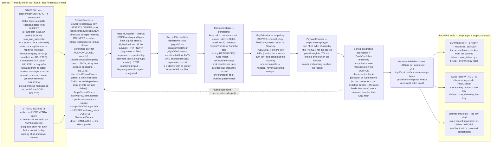

# `amps-connectors`

A **multi-source connector framework** — raw framed TCP feeds, Kafka topics, database queries,
Hazelcast topics and Hazelcast caches, and AMPS topics themselves — that decodes, filters,
reshapes, keys and publishes records into [60East AMPS](https://www.crankuptheamps.com/)
topics, plus the **Spring Boot applications** built on it. One application runs one or more
connectors; everything is driven from configuration.

The transport is one block in the connector's configuration. Everything after it — decoding,
the filter, the transforms, the key, the encoder, batching and the publish — is shared, so a
Kafka connector and a socket connector differ by the six lines under `source:`.

Around the pipeline sit three application-level things, also configuration: **resources** (a
reference table loaded from a database, reloadable, that a code transform enriches from),
**alerts** (JSON onto an AMPS or Kafka topic when something goes wrong) and a **control
channel** (commands such as `reload` and `status` read from an AMPS or Kafka topic). The one
place code is needed — an enrichment that looks a record up somewhere — is a
`RecordTransform` bean in a module under `apps/`, and `apps/instrument-enricher/` is the
worked example.

This is the module to read when the question is *how does something that is not AMPS become a
SOW record*: the answer involves a key that one of two ends computes, a delete that is
sometimes a filter and sometimes a key, and a batch whose flush is what makes an
acknowledgment honest.

---

## Layout: framework, drivers, applications

```
amps-connectors/
├── core/             :amps-connectors:core — the pipeline as a java-library
│                     (decode → filter → transform → key → encode → batch → publish)
│                     + the source, resource, alert-sink and command SPIs + the config
│                     model and validator + auto-configuration + test fixtures (incl.
│                     the integration-test runner). Knows no transport.
├── source-tcp/       :amps-connectors:source-tcp — the framed-socket driver (java.net)
├── source-kafka/     :amps-connectors:source-kafka — the Kafka consumer driver, and the
│                     Kafka ALERT SINK (the framework's one producer lives here too)
├── source-jdbc/      :amps-connectors:source-jdbc — the polled-query driver (java.sql)
│                     + JdbcValues, the one result-set-to-value conversion
├── source-hazelcast/ :amps-connectors:source-hazelcast — the Hazelcast client driver
├── source-amps/      :amps-connectors:source-amps — an AMPS topic as a SOURCE (subscribe,
│                     sow_and_subscribe, bookmark replay): a bridge between topics, and
│                     the control channel's listener. Each driver carries its own client
│                     and registers a SourceFactory; an application depends on the
│                     transports it actually dials.
├── resource-jdbc/    :amps-connectors:resource-jdbc — a query held in memory as a
│                     reloadable lookup table (JdbcLookupTable); registers a ResourceFactory
├── connector-app/    :amps-connectors:connector-app — the GENERIC runner, which depends
│                     on ALL FIVE drivers. One image, deployed N times: a config-only
│                     application is this app under its own name with its own mounted
│                     configuration.
├── apps/             custom-code applications (auto-discovered by settings.gradle.kts);
│                     the escape hatch when an app needs its own transform bean or an
│                     unusual driver. See apps/README.md.
│   └── instrument-enricher/   the worked example: a RecordTransform that enriches FIX
│                     orders from a JDBC lookup table (symbol → SEDOL, currency)
├── config/           the DEPLOYABLE applications: config/<env>/<flow>/<app-name>/
│   ├── local/        one directory per application; `common/` per env for the shared
│   │   ├── common/   AMPS endpoint. Adding application #51 = mkdir + one application.yml.
│   │   ├── streams/{ticks-tcp,orders-kafka,instrument-enricher}/
│   │   ├── db/{positions-jdbc}/
│   │   └── cache/{events-hazelcast,positions-hazelcast}/
│   └── dev/common/   the same shape, pointed at the dev servers
├── docker/           ONE shared spring-boot.Containerfile for every app image
└── scripts/          amps-connectors-compose.sh — generates + drives podman compose
                      from the config tree
```

Configuration layers, later sources winning (**the jar knows no environment**):
baked [`application.yml`](connector-app/src/main/resources/application.yml) (safe defaults, no
connectors) → `config/<env>/common/` → `config/<env>/<flow>/<app-name>/`, the mounted pair
arriving as `SPRING_CONFIG_ADDITIONAL_LOCATION=file:/app/config/common/,file:/app/config/instance/`.
Endpoints are `${AMPS_HOST:localhost}`-style placeholders (`AMPS_PORT`, `KAFKA_HOST`,
`TCP_HOST`, `JDBC_HOST`, `HAZELCAST_HOST` likewise) so the same files serve IDE runs and
containers. Never define `amps-connectors.connectors` in `common/` — two lists merge **by
index** — and never bake one; `ConfigTreeTest` enforces the tree's rules (every instance binds
and validates, names exactly one transport, no two apps in an environment share a connector
name, no credential literals) without booting anything. A **credential key** — anything named
`…password…`, `…secret…`, `…token…` — may carry a single `${VAR:}` placeholder and nothing
else: the name of a secret is safe in git, the secret is not. `resources:`, `alerts:` and
`control:` belong in the instance file too: the alerts sink and the control listener log on
to AMPS as `<prefix>-<application>-alerts` and `<prefix>-<application>-control-source`, and
AMPS refuses a second logon under a name in use — two IDE runs sharing one
`spring.application.name` would be the first thing to find that out.

The topics these applications publish into are a flow of their own:
[`server/config/flows/amps-connectors/amps-config.xml`](../server/config/flows/amps-connectors/amps-config.xml).

---

## Architecture and data flow

One connector = one upstream feed = one AMPS topic. Everything between the two ends is
transport- and format-agnostic: the source only decides what a record *is*, the format only
decides how a payload becomes `field → value`, and the target block only decides what AMPS is
asked to do with it — so any source can feed any format can feed any topic shape.


```mermaid
flowchart LR
    subgraph SRC["source: — exactly one of tcp / kafka / jdbc / hazelcast / amps"]
        direction TB
        STATE["STATEFUL feed (jdbc.mode=SNAPSHOT, a compacted<br/>Kafka topic, a reliable Hazelcast topic from OLDEST,<br/>a Hazelcast IMap, an AMPS SOW via sow_and_subscribe<br/>or a journal via a bookmark)<br/>state, or a log that can be replayed into state:<br/>the whole query re-run (a vanished key DELETES),<br/>a tombstone (null value → DELETE), a ringbuffer<br/>replayed from its oldest retained message, a cache<br/>re-read on every connect (an entry removed DELETES),<br/>an out-of-focus message (a record left the SOW → DELETE)"]
        STREAM["STREAMING feed (a socket, an INCREMENTAL query,<br/>a plain Hazelcast topic, an AMPS subscribe)<br/>a log, and often not even that: a socket replays<br/>nothing at all and never deletes"]
    end

    SUB["RecordSource → SourceRecord(data, key, UPSERT / DELETE, ack)<br/>TcpRecordSource (LISTEN binds and accepts N feeds;<br/>CONNECT redials) · KafkaRecordSource (group offsets<br/>committed only for ACKNOWLEDGED records) ·<br/>JdbcRecordSource (polls; rows → JSON; a key that<br/>stopped appearing → DELETE) · HazelcastRecordSource<br/>(client; a plain or reliable TOPIC, or an IMap whose<br/>entry events key and delete) · AmpsRecordSource<br/>(its own HAClient, named &lt;prefix&gt;-&lt;connector&gt;-source;<br/>sow/publish/delta_publish → UPSERT, oof/sow_delete<br/>→ DELETE) · SimulatedSource<br/>(driver: SIMULATED — the demo profile)"]

    DEC["RecordDecoder — format:<br/>JSON (nesting and types kept: a price stays a<br/>BigDecimal, so 185.50 survives) · FIX / NVFIX<br/>(tag=value on field-separator; a repeated tag<br/>becomes tag#2, so groups survive) · TEXT<br/>malformed input → IllegalArgumentException → rejected"]

    FLT["RecordFilter — filter:<br/>declarative rules (equals/not-equals/in/matches/<br/>gt/gte/lt/lte/present, combined ALL or ANY)<br/>AND an optional SpEL expression over #f<br/>a DELETE with an empty body SKIPS the filter"]

    TRF["TransformChain — transforms:<br/>keep · drop · rename · set · values · derive (SpEL,<br/>typed result) · bean (a RecordTransform from the app,<br/>holding RESOURCES) · rules (when → set/bean/alert/drop,<br/>a hit counter per rule)<br/>in order; null drops the record<br/>any transform at all disables passthrough"]

    KEY["KeyExtractor — amps.key:<br/>SERVER: check the key fields are present, send no SowKey<br/>PUBLISHER: join the key fields (or take the source's<br/>own key) and send it as the SowKey<br/>undeterminable → rejected, never published unkeyed"]

    ENC["PayloadEncoder — amps.message-type:<br/>json / fix / nvfix, chosen by the TARGET not the source<br/>passthrough AUTO: the original bytes when the formats<br/>match and nothing touched the record"]

    BAT["Spring Integration aggregator + BatchPublisher<br/>release by amps.batch.max-messages (on the SOURCE<br/>thread — the back-pressure) or flush-interval<br/>(on the connector's own deadline thread — the quiet<br/>feed's insurance) every command in order, then ONE flush"]

    PUB["HaAmpsPublisher — one HAClient per connector<br/>URI tcp://host:port/amps/&lt;message-type&gt;<br/>publish store replays what a reconnect left in doubt"]

    subgraph TGT["the AMPS topic — amps.topic + amps.command"]
        direction TB
        KEYED["SOW topic WITH a &lt;Key&gt; — key.mode: SERVER<br/>the server derives the key from the payload<br/>delete = sow_delete by a FILTER over the key fields"]
        UNKEYED["SOW topic WITHOUT a &lt;Key&gt; — key.mode: PUBLISHER<br/>the SowKey header is the key<br/>delete = sow_delete by that key"]
        JRN["journal-only topic — no key at all<br/>every record appended; on-delete: IGNORE<br/>read back with a bookmark subscription"]
    end

    STATE --> SUB
    STREAM --> SUB
    SUB --> DEC --> FLT --> TRF --> KEY --> ENC --> BAT --> PUB
    PUB --> KEYED
    PUB --> UNKEYED
    PUB --> JRN
    BAT -. "flush succeeded → record.acknowledge()" .-> SUB
```

Reading the two ends against each other:

- **Any source can feed any format can feed any topic shape.** The middle of the pipeline never
  asks which transport delivered the record or which topic will receive it.
- **`format` and `message-type` are different questions.** `format` is what the source's bytes
  *are*; `message-type` is what AMPS is told they are — and it also picks the client URI, so a
  FIX connector and a JSON connector in one application hold two connections. A connector that
  reads FIX and publishes `json` is exactly the translation this framework exists to do.
- **Removal only exists where there is a SOW**, which is why `on-delete: IGNORE` is the honest
  setting for a journal topic rather than a default nobody reads.
- **The acknowledgment travels backwards.** It is the batch's flush, not the publish, that
  tells a source a record is safe — which is why Kafka's offsets and a JDBC watermark move on
  a batch boundary and not a record boundary.
- **AMPS is a source too.** `source.amps` subscribes to a topic — of the same instance the
  application publishes into, or of another one — through a second client of its own, so a
  connector whose two ends are both AMPS is a bridge, and the control channel below is a
  connector of this kind with no target at all.

Around the pipeline, and not in it, are four things a connector never asks about but a code
transform, an operator and a dashboard do. They are plain beans with plain threads, started
and stopped in this order (stop is the reverse), each one late enough that what it needs is
already there:

| phase (`SmartLifecycle`) | bean | what it is |
|---|---|---|
| `MAX − 3000` | `AlertManager` | the application's one `Alerts`: any thread may `raise(Alert)`; one daemon thread delivers to the log and every `AlertSink` (AMPS, Kafka), behind a severity floor, repeat suppression and a bounded queue |
| `MAX − 2000` | `ResourceRegistry` | every `AppResource` by name — a `JdbcLookupTable` from a `resources:` entry, or a bean the application declares — started before the connectors so the first record finds its table, stopped after them so the last record is still enriched |
| `MAX − 1000` | `ConnectorManager` | the connectors, as before; a connector's pipeline now compiles `rules` steps and `bean` steps against a `TransformContext` (its name, the transform beans, `Alerts`) |
| `MAX − 500` | `CommandDispatcher` | the control channel: a `RecordSource` like any connector's, resolved from `control.source`, feeding `CommandHandler`s — `reload` and `status` built in — one command at a time |

Nothing in the pipeline knows the dispatcher exists, and nothing in the dispatcher knows a
transport: it hands the `control.source` block to the same `SourceResolver` a connector uses,
as a synthetic connector named `<application>-control`. That is what makes "commands from
Kafka" and "commands from AMPS" the same six lines a feed would be.

**A Hazelcast map is the one source already shaped like a SOW.** `source.hazelcast` names a
`topic:` *or* a `map:`, never both, and the two are different feeds: a topic message is a
payload with no key and no way to say that something stopped existing, while an `IMap` entry
has identity and can cease to exist. A map connector registers **one entry listener** and then
reads the **whole map** — listener first, snapshot second, so a write during the read is
delivered twice (a duplicate upsert, which a SOW absorbs) rather than not at all — and every
row of that snapshot is an upsert keyed by `String.valueOf(key)`. Added and updated are
upserts; removed, evicted and expired are **deletes with an empty body**, which is exactly
what a PUBLISHER-keyed topic needs and all a removal can be sure of. The caveat is worth
knowing before it bites: entry events are **at-most-once and unordered across partitions** —
Hazelcast neither queues them for a client that is away nor replays them — so the snapshot on
every (re)connect is not an optimisation but the repair, and `snapshot: false` gives it up on
purpose. The one gap a snapshot cannot close is a *missed delete*: a map that no longer holds a
key says nothing about a SOW record that still does. `clear()` and a map-wide eviction name no
keys at all, so they are counted and logged rather than turned into guessed deletes.

## The pipeline, stage by stage

| stage | configured by | what it does | what a failure counts as |
|---|---|---|---|
| decode | `format`, `field-separator` | payload → ordered `Map<String, Object>`, nesting and types intact | `rejected` |
| filter | `filter:` | rules (ALL/ANY) **and** a SpEL expression; addresses fields as the *source* names them | `filtered` |
| transform | `transforms:` | `keep` `drop` `rename` `set` `values` `derive` `bean` `rules`, in order; `null` drops the record. A `bean` is code from the app and may hold resources; a `rules` step is `when` → `set`/`bean`/`alert`/`drop`, counting hits per rule | `dropped`; a SpEL evaluation failure (`derive`, a rule's `when`) is `rejected` |
| key | `amps.key` | SERVER: check; PUBLISHER: build the SowKey — or refuse | `rejected` |
| encode | `amps.message-type`, `passthrough` | field map → json/fix/nvfix, or the original bytes unchanged | `rejected` |
| batch | `amps.batch` | accumulate, release by size or idle time, one flush per batch | `failed` batches, plus a `PUBLISH_FLUSH_TIMEOUT` alert |

Five counters rather than one, because "the topic has fewer records than the feed" has five
different causes and they need telling apart. They are what the status line prints — one line
per connector, then one `rules[…]` per rules step with each rule's hits, then one line per
resource under `resource status:`, because a connector that is `RUNNING` beside a table that
is `UNAVAILABLE` is publishing unenriched records and the two lines belong next to each
other:

```
connector status:
  ticks-tcp                RUNNING   connectors/ticks             received=8120 published=8120 batches=17 failed=0 rejected=0 filtered=0 dropped=0 ignored-deletes=0
  orders-enriched          RUNNING   sow/connectors/orders        received=412 published=380 batches=9 failed=0 rejected=0 filtered=32 dropped=0 ignored-deletes=0 rules[limit-without-price=12,large-notional=3]
resource status:
  instruments AVAILABLE rows=1234 loaded=2026-09-19T14:00:00Z reloads=3 failures=0
```

The alert manager and the control channel keep counters of their own (`alerts raised=… sent=…
suppressed=… filtered=… dropped=… sink-failures=… queued=…` and `control: … received=…
succeeded=… failed=… ignored=…`, from `AlertManager.status()` and
`CommandDispatcher.status()`); the dispatcher logs its line at stop, and a `status` command
puts the connector and resource lines into an alert, but neither counter set rides on the
periodic status log.

## Batching and the acknowledgment contract

A connector does not publish records, it publishes **batches**, and the batch is also the unit
of durability:

1. Each record the pipeline accepts is sent into a `DirectChannel`, so the **source's own
   thread** carries it through decode, filter, transforms, key and encode.
2. A Spring Integration **aggregator** holds the results. It releases when
   `amps.batch.max-messages` have accumulated — on that same source thread, which is where the
   back-pressure comes from: a source that outruns AMPS ends up waiting in its own reader loop
   instead of growing a queue — or when `amps.batch.flush-interval` has passed since the
   batch's first record, on a deadline thread that is **this connector's own**, so a quiet
   feed's last record does not sit unsent and a busy neighbour cannot make it wait.
3. `BatchPublisher` issues every command of the batch in order (publish, delta_publish,
   sow_delete — order is preserved, because a delete and the publish beside it are not
   commutative), and then waits **once** on `publishFlush` for `amps.flush-timeout`.
4. **Only if that flush returns** does it call `acknowledge()` on every record in the batch.
5. Stopping a connector closes the source, then forces the aggregator's partial batch out
   *synchronously*, then unregisters the flow, then disconnects. Reversed, the last few records
   the source had already read would be dropped on the floor at every shutdown.

What an acknowledgment means is the source's business: **Kafka** commits offsets from its poll
thread for acknowledged records only (`enable.auto.commit=false`), and **JDBC INCREMENTAL**
persists its watermark. TCP and Hazelcast have nothing to acknowledge to, so their records
carry no ack at all.

The contract is **at-least-once**. A crash between a publish and its flush re-reads those
records; a flush that times out is not data loss either — the HAClient's publish store still
holds everything unacknowledged and replays it after a reconnect — it only means the batch's
records are not acknowledged *yet*. Duplicates are harmless on a keyed topic (the second
publish is the same upsert) and visible on a journal topic, which is the trade a journal topic
makes anyway.

`publish-store: MEMORY` survives a reconnect, `FILE` survives a restart for the price of a
synchronous write per publish, and `NONE` turns the whole thing off and makes the connector
fire-and-forget.

## The two key modes, and the trap one of them exists to avoid

AMPS will not let both ends decide a record's identity, so `amps.key.mode` has to agree with
the topic's definition in the server flow:

| | `mode: SERVER` | `mode: PUBLISHER` |
|---|---|---|
| the topic is declared | **with** a `<Key>` (`<Key>/11</Key>`) | **without** a `<Key>` |
| who computes the key | AMPS, from the payload | the connector, as the SowKey header |
| `key.fields` | required — the fields to **check** | the fields to **join**; empty means "use the source's own key" |
| a record missing them | rejected (AMPS could not key it) | rejected (there is no SowKey to send) |
| a delete | `sow_delete` by a **filter** built from the key fields (`/account = 'ACC-1' AND /symbol = 'AAPL'`) | `sow_delete` by that **key** |

**The trap.** AMPS does *not* reject a publish that carries no SowKey onto a SOW topic declared
without a `<Key>`. Measured against 5.3.5.135: the record is filed under a sentinel key
(`18446744073709551615`) and **every subsequent keyless publish overwrites that same record**.
A whole feed can therefore collapse onto one SOW row while every log line and every counter
says the connector is healthy, and nothing downstream can tell. So it is refused at both ends:
`ConnectorValidator` will not accept PUBLISHER mode unless `key.fields` or a key-bearing source
(kafka, hazelcast with a `map`, jdbc with `key-columns`, or amps in `SOW_AND_SUBSCRIBE` mode —
a SOW record has a SowKey, a journal message does not, and a plain `subscribe` might be
reading either) can supply a key, and at runtime
`KeyExtractor` throws rather than publishing unkeyed — the record is counted as `rejected` and
never sent.

The mirror-image mistake belongs to SERVER mode and is just as quiet: a payload AMPS cannot
parse. A FIX connector with `field-separator: "|"` publishes pipe-delimited FIX, because the
connector's separator serves both ends — and AMPS's `fix` parser expects SOH, so a topic keyed
`/11` gets nothing it recognises. Measured on 5.3.5.135, the publish is **accepted**, the record
is filed under a key derived from nothing useful, and no `/11` filter ever matches it again.
Read pipes if the feed writes them, by all means, but then publish `json`, or re-encode to SOH.

**Deletes.** `amps.on-delete` is `SOW_DELETE` or `IGNORE`. A DELETE record whose payload is
empty *skips the filter* — a Kafka tombstone carries no fields, so any rule at all would refuse
it and the record it was meant to remove would live forever — but it still goes through the
transforms, because its key fields come out of the same namespace an upsert's do. A delete that
cannot be addressed (no key, no usable filter) is counted as `ignored-deletes` and dropped, not
guessed at. `IGNORE` is the right setting for a journal topic, where there is nothing to remove
from.

## Rules

A `rules:` transform step is a list of named conditions with actions, evaluated in order over
every record — the piece of per-record logic that is more than a `derive` with a ternary in it
and less than code:

```yaml
      transforms:
        - rules:
            - name: limit-without-price
              when: "#f['40'] == '2' && !#f.containsKey('44')"
              then: { alert: { severity: WARN, code: LIMIT_WITHOUT_PRICE, message: "limit order #{#f['11']} has no price" } }
            - name: large-notional
              when: "#num(#f['38']) * #num(#f['44']) > 1000000"
              then: { set: { "5001": LARGE } }
              stop: false
            - name: test-orders
              when: "#r.attributes['topic'] == 'orders.test' || #str(#f['1']).startsWith('TEST-')"
              then: { drop: true }
```

`when` is SpEL in the one dialect every expression here speaks — `#f` is the field map as the
earlier steps *and the earlier rules* left it, `#r` is the `SourceRecord` (`#r.key`,
`#r.action`, `#r.attributes['topic']`), `#num(x)` and `#str(x)` coerce — and it has to answer
a boolean. `then` names one or more actions, and they always run in the one order that makes
sense: **`set`** the literal fields, run the **`bean`** (a `RecordTransform` bean, by name),
raise the **`alert`**, and only then **`drop`**. The alert comes before the drop on purpose:
the record a rule discards is exactly the one somebody wants to hear about, and it will never
reach the topic to be seen there. A bean that returns `null` drops the record the same way,
alert included. `stop: true` ends the step after a hit, which is how "first match wins" is
spelled; the default carries on to the next rule, so a `set` by one rule is a fact the next
can test.

The **name** is not decoration: it is the rule's hit counter on the connector's status line
(`rules[limit-without-price=12,large-notional=3]`), the `rule` detail on every alert the rule
raises, and the word an operator uses to say which line of the configuration fired. Two
connectors naming a rule `large-notional` are two lines in the status log, not one number,
which is why rules are a pipeline step per connector rather than an application-wide
`RuleManager`. A rule's alert carries the connector, one detail (`rule`), a code (required —
the stable name a dashboard groups by and repeat suppression collapses on), a severity (`WARN`
unless said otherwise) and a message that is a **template**: `#{…}` inside literal text,
rendered per record over the fields as the rule leaves them, so the order id is in the
sentence and nobody has to go and look it up. A message with no `#{…}` is a literal; no
message at all is the rule's name.

Failures keep the pipeline's distinction. A `when` or a template that cannot be *evaluated* —
a method that does not exist on the value it was given, a `when` that answered a string — is
an `IllegalArgumentException` the pipeline counts as **rejected**, like a `derive` that fails;
a rule that drops is counted as **dropped**, like any transform returning `null`. The input
map is never written to: every `set` lands in a copy. Everything that can be wrong with the
*configuration* is wrong at startup: `ConnectorValidator` refuses a rules step with no rules,
a rule with no name or a name used twice in the step, a `when` that does not parse, a `then`
with no action ("it would do nothing but count"), an alert without a code, a message that does
not parse as a template, and a blank `bean`; `RuleSet.compile` then refuses a `bean` that is
not a registered `RecordTransform`.

## Resources

An **`AppResource`** is a named, shared, lifecycle-managed object that a code transform looks
things up in: a reference table loaded from a database, a KDB client answering market data by
RIC, a gRPC stub. It is the seam between the framework and whatever a transform needs beyond
the field map. A `RecordTransform` is stateless by contract and runs on a source's reader
thread; the connection it enriches from is neither, and it wants starting before the first
record and stopping after the last. So the connection is a resource, the registry starts and
stops it around the connectors, and the transform *holds* it.

The SPI ([`AppResource`](core/src/main/java/com/demo/amps/connectors/resource/AppResource.java))
is `name()`, `start()`, `stop()`, `isAvailable()`, and — for the ones that have something to
re-read — `isReloadable()` and `reload()`, plus a one-line `status()` that starts with the
name. Deliberately not `AutoCloseable`: Spring closes an `AutoCloseable` bean itself during
context destruction, later than the registry's `stop()`, and every resource's shutdown would
run twice, out of phase with the connectors that use it.

There are two ways to have one, and the
[`ResourceRegistry`](core/src/main/java/com/demo/amps/connectors/resource/ResourceRegistry.java)
treats them exactly the same:

- **A configured kind**, built by a `ResourceFactory` from its module — the mirror image of a
  `SourceFactory`. Only `jdbc` exists today, contributed by `:amps-connectors:resource-jdbc`:

  ```yaml
  amps-connectors:
    resources:
      - name: instruments                 # unique across the list AND the beans
        enabled: true                     # false: configured, but neither built nor started
        jdbc:
          url: "jdbc:postgresql://${JDBC_HOST:localhost}:5432/refdata"
          username: refdata_ro
          password: "${JDBC_PASSWORD:}"   # a placeholder and nothing else, ever
          query: SELECT symbol, sedol, isin, currency, ric FROM instruments
          key-columns: [symbol]           # what a transform looks a row up by
          key-separator: "|"
          reload-interval: 5m             # 0 = reload on demand (the control channel) only
          reconnect-delay: 5s             # backoff after a failed load
          fetch-size: 1000
  ```

  An entry names exactly one kind (the validator refuses none or several), and an entry no
  factory on the classpath claims is a *build* problem: the exception says which module to
  add (`:amps-connectors:resource-jdbc`), the way `SourceResolver` does for a source.
- **A bean the application declares** — anything with no generic configuration, such as a
  KDB or gRPC client — which needs no entry at all. Every `AppResource` bean in the context
  is collected and registered under its own `name()`, before the configured entries.

The registry is a `SmartLifecycle` at phase `MAX − 2000`: after the `AlertManager`
(`MAX − 3000`), so a resource can raise from its own start; before the `ConnectorManager`
(`MAX − 1000`), so a connector's first record finds its table loaded; and the
`CommandDispatcher` (`MAX − 500`) comes last, so a command that arrives during startup finds
everything running. Stop is the reverse. Two resources with one name are refused at
construction rather than resolved by whichever registered last — a transform holding the
wrong `instruments` would enrich every record wrongly and no counter would say so. **Start is
not fail-fast**: a resource whose `start()` throws is logged, raised as
`RESOURCE_START_FAILED` and left to its own retry (the same rule as a `RecordSource`), while
the resources after it still start; what the failure means is the transform's business, and
`isAvailable()` is how it asks. Resources are reported as one line each under
`resource status:` in the periodic log, and a start failure stays on that line as
`start-failed="…"`.

A transform gets its resource by name and type, **once, at construction**, so a typo fails at
boot rather than per record:

```java
JdbcLookupTable instruments = registry.lookup("instruments", JdbcLookupTable.class);
```

An unknown name lists the ones that exist; a known name of the wrong type says which type it
is. `find(name)` answers an `Optional` for code that would rather ask; `reload(name)` and
`reloadAll()` are what the `reload` command calls (an unknown name is an argument error, a
non-reloadable one is unsupported, a throw is wrapped with the resource's message; `reloadAll`
reloads every reloadable resource, each one whether or not the one before it failed, and then
reports every failure at once).

**`JdbcLookupTable`** is the `jdbc` kind: one query is the whole table. Every load runs it,
turns each row into the same value map the JDBC *source* publishes (`JdbcValues.row` — a
`DECIMAL` stays a `BigDecimal`, a timestamp becomes ISO-8601 text, `NULL` stays `null`; the
two share one conversion so a filter written against a published row and a lookup written
against the table agree about the same column), keys it by the `key-columns` values joined
with `key-separator` (as the driver prints them — the same rule `JdbcRecordSource` keys its
records by), and swaps the result in as one immutable snapshot. A lookup (`find(key)` →
`Optional<Map<String, Object>>`) reads whichever snapshot is current, so a record being
enriched never sees a half-loaded table and never waits for a load in progress. **A failed
reload keeps the last good copy**: a table that went empty because the database blinked would
turn every record into a miss, and the miss would look exactly like an unknown symbol, so the
previous snapshot stays, `isAvailable()` stays true, and `RESOURCE_RELOAD_FAILED` (WARN) says
so with the kept row count in its details. Only the load in `start()` has nothing to fall back
on: it is synchronous (the connectors start after it, and the first record should find the
table there), a failure raises `RESOURCE_LOAD_FAILED` (ERROR) and the table starts
unavailable. Reloads come from a daemon thread `<name>-reload` every `reload-interval` (none
when it is `0`), backing off to `reconnect-delay` after a failure, and from `reload()` on
demand; the two are serialised so a command landing mid-timer does not run the query twice at
once. Connections are opened per load and closed with it. A row with a `NULL` key column is
skipped, a key that appears twice keeps the last row (as a SOW would), each once-warned per
load; a key column the query does not return **fails the load** with the driver's own message
rather than quietly skipping every row as keyless. The status line is
`instruments AVAILABLE rows=1234 loaded=2026-09-19T14:00:00Z reloads=3 failures=0`, or
`… UNAVAILABLE rows=0 loaded=never …` before the first load succeeds. One thing to know before
it bites: a database that is slow or down delays boot by one connect attempt per resource, so
put a `connectTimeout` in the URL.

**KDB, gRPC and everything else** are `AppResource` *beans*, not modules: there is no generic
configuration for "a kdb+ handle that answers by RIC", so there is nothing for a
`resources:` entry to say. An application under `apps/` declares
`@Bean AppResource kdbMarketData(...)` — `start()` opens the handle, `isAvailable()` reports
it, `stop()` closes it, `isReloadable()` stays `false` — and the enricher looks it up with
`registry.lookup("kdb-market-data", KdbMarketData.class)` exactly as it would a table. A
`resource-kdb` module only makes sense once there is a real endpoint to test it against.

## Alerts

Everything that can go wrong raises an [`Alert`](core/src/main/java/com/demo/amps/connectors/alert/Alert.java)
through the one-method [`Alerts`](core/src/main/java/com/demo/amps/connectors/alert/Alerts.java)
seam — `raise(Alert)`, which never blocks and never throws — and the
[`AlertManager`](core/src/main/java/com/demo/amps/connectors/alert/AlertManager.java)
delivers it to the log and to every `AlertSink` from a thread of its own. On the wire an alert
is one flat JSON object with a fixed set of fields, always all present:

```json
{"timestamp":"2026-09-19T14:00:00Z","application":"instrument-enricher","severity":"WARN",
 "code":"PUBLISH_FLUSH_TIMEOUT",
 "message":"flush did not complete within PT10S; the batch stays unacknowledged and will be re-read",
 "connector":"orders-enriched","repeats":0,"details":{"timeout":"PT10S"}}
```

`code` is the stable, machine-readable name a dashboard groups by; `message` is the sentence
for a human and is never parsed; `details` is whatever a human would ask for next; `connector`
is `null` for an application-level alert; `timestamp` (ISO-8601, UTC) and `application` are
stamped by the manager, which is how the code that raises stays ignorant of when and on whose
behalf. `application` is `alerts.application`, else `spring.application.name`, else
`amps-connector` — resolved in code rather than by a `${spring.application.name}` placeholder,
because the config tree is bound by a test with no application running.

The design follows from where `raise` is called: on a source's reader thread, mid-record,
often for the same reason a thousand times in a row. So the caller's thread does only what is
cheap and bounded, and everything with a network in it happens on the daemon thread
`amps-alerts`:

1. **The severity floor.** Below `min-severity` (`INFO` by default; `INFO < WARN < ERROR`) the
   alert is dropped where it is raised and counted as `filtered`. `enabled: false` raises
   nothing at all, not even a log line.
2. **Repeat suppression**, keyed on `code|connector`. The first alert with a key opens a window
   of `suppress-repeats` (30s by default; `0` sends every one); every alert with the same key
   inside it is counted and dropped. When the window closes, the *last* of the repeats is sent
   with `repeats` set to the count, so a reader sees the first symptom promptly and the size
   of the storm afterwards, and a topic that would have carried ten thousand `UNKNOWN_SYMBOL`
   alerts carries two. The trade is worth knowing: a storm across many *different* symbols
   collapses too, and the summary carries the last one.
3. **A bounded queue** (`queue-size`, 1000 by default) that drops its *oldest* entry when full
   — the newest is the one that says what is happening now — and counts the drop, so a sink
   that cannot keep up costs alerts, never memory and never a source thread's time.

The delivery thread logs each alert at its own severity, hands it to every sink, and calls
`flush()` on the sinks when the queue has just emptied, so a burst costs one round trip rather
than one per alert. A sink that throws is counted (`sink-failures`) and skipped for that
alert; the other sinks still get it. `stop()` drains what is queued (up to two seconds),
closes any open suppression window early — what it counted is worth saying more than the
exact moment it would have closed — and closes the sinks.

Sinks are **collected, not configured**: the manager takes every `AlertSink` bean in the
context, so an application adds a destination by declaring one, and a test declares a
`RecordingAlertSink`. With no sink at all the alerts are in the log, which is the default and
not a mistake. Two ship:

| sink | switched on by | client | what it does |
|---|---|---|---|
| `AmpsAlertSink` (core) | `alerts.amps.topic` | `HaAmpsPublisher` logged on as `<prefix>-<application>-alerts` against `/amps/json` | `publish` of the JSON, no SowKey; `flush()` waits `flush-timeout` for the persisted ack and throws if it does not come. AMPS being down at `start()` is counted and the sink kept: it connects on the first alert instead, waiting `reconnect-delay` between attempts so a server that is not answering cannot pin the delivery thread |
| `KafkaAlertSink` (`source-kafka`) | `alerts.kafka.topic` (needs `bootstrap-servers`; the producer client on the classpath) | a `KafkaProducer` with `client.id=<application>-alerts`, `acks=1`, `max.block.ms=5000`, String serialisers, `properties` applied last | `send` keyed by the alert **code** (so a compacted topic keeps the latest of each kind of trouble); the producer is built lazily if `start()` could not; a send the broker fails is logged from the callback and reported by the next `flush()`, which throws with the count, so `sink-failures` moves |

The Kafka producer lives in `source-kafka` rather than a module of its own so an application
that reads Kafka and alerts to Kafka carries *one* client dependency; the module's rule is
"everything that speaks Kafka", not "everything that reads it".

Every code the framework raises, and what to expect in `details`:

| code | severity | raised by | when | details |
|---|---|---|---|---|
| `SOURCE_ERROR` | WARN | `Connector` | a record threw on the way from the source into the flow — a path that should be unreachable, which is why it is worth an alert | `error`, `sourceErrors` |
| `PUBLISH_FAILED` | ERROR | `AlertingAmpsPublisher` | a `publish`, `delta_publish` or `sow_delete` threw; the exception is rethrown and the batch fails as before | `operation`, `topic`, `error` |
| `PUBLISH_FLUSH_TIMEOUT` | WARN | `AlertingAmpsPublisher` | a batch's flush did not complete within `flush-timeout`; not data loss — the publish store replays — but the batch stays unacknowledged and will be re-read | `timeout` |
| `CONNECTOR_START_FAILED` | WARN | `ConnectorManager` | a connector's start attempt failed (AMPS refused the logon, the source would not start); raised on every five-second retry and left to suppression to collapse | `error`, `retryIn` |
| `RESOURCE_START_FAILED` | ERROR | `ResourceRegistry` | a resource's `start()` threw; the others still start | `resource`, `error` |
| `RESOURCE_LOAD_FAILED` | ERROR | `JdbcLookupTable` | the first load, in `start()`, failed; the table is unavailable until a reload succeeds | `resource`, `error` |
| `RESOURCE_RELOAD_FAILED` | WARN | `JdbcLookupTable` | a reload (timer or command) failed; the previous snapshot stays in force | `resource`, `error`, `available`, and `rows`/`loaded` of the kept snapshot |
| `COMMAND_INVALID` | WARN | `CommandDispatcher` | a payload on the control channel is not a command (not JSON, not an object, no `command`, non-scalar `args`) | `error`, `payload` (the first 200 characters) |
| `COMMAND_UNKNOWN` | WARN | `CommandDispatcher` | no handler answers to the command's name; the message lists the ones that do | `command`, `target`, `requestId` |
| `COMMAND_FAILED` | WARN | `CommandDispatcher` | a handler threw — a `reload` of a resource that does not exist, is not reloadable, or whose database said no | `command`, `target`, `requestId`, `error` |
| `STATUS` | INFO | `StatusCommand` | the reply to a `status` command: the alerts topic is the application's only outbound channel, so an INFO alert is what a reply is | `connectors`, `resources` — the status lines, as two lists |
| `<code>` of a rule | as configured (WARN default) | `RuleSet` | the rule's `when` held | `rule` |

The example application adds two of its own: `RESOURCE_UNAVAILABLE` (the lookup table has no
snapshot, so the record follows the on-miss policy without a lookup having happened) and
`UNKNOWN_SYMBOL` (WARN, with `symbol` and `clOrdId`; the symbol is not in the table). Both
are collapsed by suppression like any other — on the code alone, since a bean transform is
not told which connector runs it (see "Writing a code transform").

Where the pieces meet the pipeline: the AMPS client of every connector is wrapped in an
[`AlertingAmpsPublisher`](core/src/main/java/com/demo/amps/connectors/alert/AlertingAmpsPublisher.java)
inside `Connector`'s constructor — a decorator, so `BatchPublisher`, which is about the
at-least-once contract, stays ignorant of who is listening — and a `rules` step raises under
its connector's name because the `TransformContext` it was compiled with carries it.

## Control channel

The control channel reads **commands** from a topic and hands each to the `CommandHandler`
that owns its name. It exists for one reason above all: a lookup table on a five-minute timer
is a table that is five minutes stale after the reference data changed, and the person who
changed it knows exactly when.

```json
{"command":"reload","target":"instruments","to":"instrument-enricher","requestId":"r-1","args":{}}
```

`command` is the only required field. The rest are conventions every handler reads the same
way: `target` is what the command is about (a resource name, or `all`), `to` is which instance
should act on it, `requestId` is whatever the sender wants echoed in the log and the alerts,
and `args` is a map of scalars for a custom handler (non-scalar values are refused). Unknown
fields are ignored, so a newer sender and an older application can still talk.

**Addressing.** A command with no `to`, or `to: all`, is for every instance. Otherwise it is
acted on when `to` equals this instance's `control.target` — blank falls back to the alerts'
application name, i.e. `spring.application.name` — or is in `control.accept-targets`, the
group names an instance answers to besides its own, so a fleet can be told `to: enrichers`
without listing every host. Anything else is **ignored**: counted, logged at DEBUG, never
alerted, because a command for another instance is not this one's mistake. A `DELETE` record
(a Kafka tombstone, an out-of-focus message) is ignored the same way — it carries no command.

**Built-in commands.** `reload` with a `target` reloads that resource; `target: all`, or no
target, reloads every reloadable one and reports every failure at once. `status` logs the
connector and resource lines now rather than at the next status tick, and raises an `INFO`
`STATUS` alert carrying the same lines as two lists — the alerts topic is the application's
only outbound channel, so that alert *is* the reply, with the `requestId` in its message.
`pause`/`resume` are not there: they need a `Connector` API change next to the batching
rework. **Custom commands** are `CommandHandler` beans (`command()` returns the name,
`handle(ControlCommand, CommandContext)` may throw), collected from the context; the
`CommandContext` record hands a handler the application name, the `ResourceRegistry`, the
`ConnectorManager` and `Alerts`, so a handler is a two-method class. A bean whose name matches
a built-in **replaces** it, and says so in the log.

Every record follows one path — parse, address, dispatch, log, acknowledge — and the last
step happens whatever became of the others: a control topic on Kafka commits its offset past a
bad command rather than re-reading it forever, because the second reading would fail the same
way. A payload that is not a command is `COMMAND_INVALID`, a command nobody handles is
`COMMAND_UNKNOWN`, a handler that threw is `COMMAND_FAILED`, all at WARN and all counted as
`failed`. Commands run **one at a time**, on the control source's reader thread and in the
order they were sent: a reload that takes a minute is a minute during which no other command
is read, and the alternative — a pool — would let two reloads of one table race.

The **source** is the whole trick. `control.source` takes exactly the block a connector's
`source:` does, resolved by the same `SourceResolver` and read by the same driver module, so
the dispatcher never learns a transport:

```yaml
amps-connectors:
  control:
    enabled: true                         # off by default: a control channel is a way in
    target: instrument-enricher           # blank -> the alerts' application name
    accept-targets: [all]                 # further names this instance answers to
    source:
      amps: { topic: connectors/control, mode: SUBSCRIBE }
      # kafka:
      #   bootstrap-servers: "${KAFKA_HOST:localhost}:9092"
      #   topic: connectors.control
      #   group-id: instrument-enricher-control-${HOSTNAME:local}   # ONE GROUP PER INSTANCE
      #   from: LATEST
```

It does that by presenting the block to the resolver as a synthetic connector named
`<application>-control`, `format: JSON` (all a source factory reads of a connector), so an
AMPS control listener logs on as `<prefix>-<application>-control-source` beside the
application's publishers, and a driver missing from the classpath is a startup failure naming
the module to add, not a retry. `ConnectorValidator` checks the block only when it is enabled
(a half-written section under a profile that never enables it is not a mistake yet): exactly
one transport block, that transport's own rules — a Kafka `group-id` above all — and no blank
`accept-targets`. A **Kafka** control topic wants one consumer group *per instance* and
`from: LATEST`: a shared group delivers each command to one member, and a broadcast that one
instance receives is not a broadcast; `LATEST` because a new instance has no business replaying
last week's reloads. An **AMPS** control topic wants `mode: SUBSCRIBE` for the same reason.
The dispatcher is always a bean — idle, with `status()` answering `control: disabled`, unless
`control.enabled` says otherwise — and its counters are `received`, `succeeded`, `failed` and
`ignored`.

## Configuration reference

The worked, commented examples are
[`application-demo.yml`](connector-app/src/main/resources/application-demo.yml) (four
connectors, one per transport, all simulated) and the deployable applications under
[`config/local/`](config/local). The shapes:

### The application

```yaml
amps-connectors:
  enabled: true                    # false starts the process with no connectors running
  status-interval: 60s             # how often each connector logs its counters
  amps:                            # ONE server block, shared by every connector
    host: ${AMPS_HOST:localhost}
    port: ${AMPS_PORT:9007}
    transport: tcp                 # tcp | tcps
    client-name-prefix: amps-connectors   # client name = "<prefix>-<connector name>"
    logon-timeout: 10s             # the logon ack, AND how long a FIRST connect keeps trying
    reconnect-delay: 5s            # HAClient reconnect backoff
    publish-store: MEMORY          # MEMORY | FILE | NONE
    publish-store-dir: build/client-state/amps-connectors   # FILE only
    flush-timeout: 10s             # how long a batch waits for the persisted ack
    publish-batch-bytes: 0         # >0 → client-side coalescing (setPublishBatching)
    publish-batch-delay: 10ms
  connectors: []                   # the list an instance file owns; NEVER in common/
  resources: []                    # shared lookup tables etc. — see below
  alerts: { }                      # enabled, log-only by default — see below
  control: { enabled: false }      # off by default — see below
```

One server block, but **one client per connector**: the message type is part of the connection
URI (`/amps/fix` vs `/amps/json`), so a FIX connector and a JSON connector cannot share one
however much they share a server. The client *name* matters too — it is the identity AMPS and
the publish store use to correlate a publisher across runs, so it comes from configuration
rather than from a generated id. Beside the connectors' clients an application may hold two
more: the alerts sink's (`<prefix>-<application>-alerts`) and the control listener's
(`<prefix>-<application>-control-source`), plus one `<prefix>-<connector>-source` per
connector that *reads* AMPS.

`logon-timeout` bounds two things. It is how long a logon waits for its ack, and it is also
about how long a connector's **first** connect keeps redialling a server that is not there
before `connect()` throws: the HA client's `connectAndLogon` otherwise retries forever, which
against a down server would block the thread starting the connector — and with it the other
connectors, the manager's retry tick, every status line and a clean shutdown. Giving up turns
that into an exception the manager already handles (the connector is retried on its
five-second tick, with a `CONNECTOR_START_FAILED` alert per attempt), and the alerts sink
connects on the first alert instead. Reconnects *after* the first success are the HA client's
own and never give up, because a server restart is exactly what an HA client is for and a
publish store nobody replays would be the wrong outcome of a long outage.

### A connector

```yaml
    - name: orders-kafka           # unique: it is the AMPS client name and the flow id
      enabled: true
      format: FIX                  # JSON | FIX | NVFIX | TEXT — what the SOURCE sends
      field-separator: "|"         # FIX/NVFIX only; default SOH. Read the note above first
      source: { ... }              # driver + EXACTLY ONE transport block
      filter: { ... }              # optional
      transforms: [ ... ]          # optional, in order
      amps: { ... }                # topic, message type, key, deletes, batching
```

### `source:` — one transport block, and the simulator

```yaml
      source:
        driver: ${source-driver:REAL}     # REAL | SIMULATED (the in-process generator)
        simulated:                        # SIMULATED only; the block below is still required
          rate: 20                        # records per second
          keys: 25                        # distinct keys to cycle, so a keyed topic converges
          template: "35=D|11=ORD-{{key}}|38={{seq}}|60={{ts}}"
        tcp:                              # ── a framed socket ──────────────────────────
          mode: LISTEN                    # LISTEN (bind, accept N feeds) | CONNECT (dial, redial)
          host: 0.0.0.0                   # LISTEN: the bind address; CONNECT: the peer
          port: 5001
          framing: DELIMITED              # DELIMITED | LENGTH_PREFIXED (4-byte big-endian)
          delimiter: "\n"                 # the YAML escape, never the byte itself
          charset: UTF-8
          connect-timeout: 5s
          reconnect-delay: 5s
        kafka:                            # ── a Kafka topic ────────────────────────────
          bootstrap-servers: "${KAFKA_HOST:localhost}:9092"
          topic: orders.fix
          group-id: amps-connectors-orders   # required: the group IS this connector's position
          from: EARLIEST                  # EARLIEST | LATEST, for a group with no offset
          poll-timeout: 500ms
          max-poll-records: 500
          reconnect-delay: 5s
          properties: {}                  # raw consumer properties, applied last
        jdbc:                             # ── a polled query (format: JSON required) ───
          url: "jdbc:postgresql://${JDBC_HOST:localhost}:5432/trading"
          username: trading_ro
          password: "${JDBC_PASSWORD:}"   # a placeholder and nothing else, ever
          query: "SELECT account, symbol, quantity FROM positions"   # run verbatim
          mode: SNAPSHOT                  # SNAPSHOT (state) | INCREMENTAL (a journal)
          key-columns: [account, symbol]  # SNAPSHOT: what makes a vanished row a DELETE
          key-separator: "|"
          # incremental-column: updated_at    # INCREMENTAL only: the forward-reading mark
          # state-file: /app/state/positions  # INCREMENTAL only: the watermark, persisted on ack
          poll-interval: 5s
          reconnect-delay: 5s
          fetch-size: 1000
        hazelcast:                        # ── a Hazelcast topic or map (a CLIENT) ──────
          cluster-name: dev
          members: [ "${HAZELCAST_HOST:localhost}:5701" ]
          topic: connector.events         # EXACTLY ONE of topic / map
          reliable: true                  # topic only: ringbuffer-backed, so there is
          reliable-from: OLDEST           #   something to replay. NEWEST | OLDEST
          # map: positions                # ...or a cache: the entry key IS the record's key
          # snapshot: true                #   map only: re-read the whole map on every
          #                               #   (re)connect. Default true, and the only thing
          #                               #   that repairs an entry event nobody received
          # predicate: "quantity > 0"     #   map only: a Hazelcast SQL predicate narrowing
          #                               #   the listener AND the snapshot, cluster-side
          connection-timeout: 5s
          reconnect-delay: 5s
        amps:                             # ── an AMPS topic (a second client) ──────────
          topic: sow/connectors/orders    # or a regular expression over topic names
          mode: SUBSCRIBE                 # SUBSCRIBE | SOW_AND_SUBSCRIBE | BOOKMARK
          bookmark: MOST_RECENT           # BOOKMARK only: EPOCH | MOST_RECENT | NOW
          # filter: "/35 = 'D'"           # an AMPS content filter, evaluated server-side
          # options: "conflation=250ms"   # extra subscription options, verbatim; oof is
          #                               #   already set for SOW_AND_SUBSCRIBE
          # server:                       # another instance; absent = the application's
          #   host: amps-2                #   own amps-connectors.amps block
          #   port: 9007
          #   transport: tcp
          timeout: 10s                    # the logon, and the subscription's own ack
          reconnect-delay: 5s
```

`driver: SIMULATED` keeps the transport block: it says what the connector stands in for, the
validator's transport rules go on applying, and the demo therefore cannot validate a
configuration the real deployment would reject. The template's placeholders are `{{key}}`
(cycling `K-<n>`), `{{seq}}` (a counter) and `{{ts}}` (an ISO-8601 instant); a FIX or NVFIX
template writes `|` between its fields and the generator swaps it for the connector's own
`field-separator`, because a literal SOH does not survive a YAML file.

A **JDBC** row has no wire format, so the source synthesises one — a flat JSON object keyed by
result-set column *label*, aliases included, numbers left as numbers — which is why
`format: JSON` is required there. A **Kafka** null value is a tombstone and becomes a DELETE;
the message key becomes the record's key. **TCP** frames carry no key and never delete. A
**Hazelcast map** value reaches the pipeline as text — a `String` passes through unchanged, a
`HazelcastJsonValue` contributes its JSON, and a `Map`, a `List` or a POJO is serialised to
JSON — so `format: JSON` is the setting that matches a cache of objects; its **topic** half
bridges each message's `toString()` and never keys or deletes anything.

An **AMPS** source has no message type of its own: the connector's `format` already says what
the payload is, and in AMPS the message type belongs to the connection URI, so `format: FIX`
subscribes through `/amps/fix`. `TEXT` is this framework's name for "a line", AMPS has no such
type, and the validator refuses the pair. The subscription is a **second client**, named
`<prefix>-<connector>-source` beside the publisher's `<prefix>-<connector>`: the pipeline runs
on this client's receive thread while a batch's `publishFlush` waits for an ack the
publisher's receive thread has to be free to read, and AMPS refuses a second logon under a
name in use, so a bridge between two topics of one instance could not otherwise come up. What
arrives, and what it becomes: `sow`, `publish` and `delta_publish` are **UPSERT**s, keyed by
the SowKey when the topic has one; `oof` and `sow_delete` are **DELETE**s that keep their
payload (an out-of-focus message carries the record's last state, and a SERVER-keyed target
needs the key fields in it to build its delete filter) and the SowKey; group markers, acks and
heartbeats carry nothing. Every record carries attributes `topic` (a regular-expression
subscription spans several), `command`, and `bookmark` when the subscription has one — so a
rule can say `#r.attributes['command'] == 'sow'`.

The three modes differ in what they deliver and in what a reconnect costs. `SUBSCRIBE` is a
plain `subscribe`: every publish from now on, nothing before, and a subscription re-issued
after an outage misses what was published during it — the socket-feed shape.
`SOW_AND_SUBSCRIBE` is `sow_and_subscribe` with `oof`, in batches of 100: the SOW's current
records first, then live, with a record leaving the SOW (a `sow_delete`, an expiry, a filter
it stopped matching) arriving out of focus as a DELETE; after a reconnect the SOW is read again
— duplicate upserts, which a keyed target absorbs, the same repair as the Hazelcast map's
snapshot. `BOOKMARK` is a `subscribe` with a bookmark: the transaction log from `bookmark`
onwards, then live, and a journalled `sow_delete` arrives as one; the topic has to be in the
flow's `<TransactionLog>`. The client keeps an **in-memory bookmark store**, and the source
discards each message from it once the pipeline has taken it — on delivery, not on the
batch's acknowledgment, because a store that lives only as long as the process cannot make a
restart resume anyway, and within the process a delivered record is already in the aggregator
or the publish store, both of which survive the *source* reconnecting. So a reconnect resumes
exactly where it left off, and a **restart starts over from the configured bookmark**:
`EPOCH` replays the whole log again, `NOW` skips everything the process was not there for,
and `MOST_RECENT` (the default) has nothing to resume from on a fresh start and behaves as
`EPOCH` then, and as "where I left off" after every reconnect. AMPS records therefore carry no
acknowledgment; replaying is the at-least-once trade the whole framework makes, and a keyed
target makes it invisible. A persistent bookmark store, discarded on acknowledgment, is the
follow-up that would turn a restart into a resume.

`start()` never throws: a daemon thread `<connector>-amps` logs on (one WARN per failed
attempt, then a retry every `reconnect-delay`), issues the subscription, and is done — from
then on the `HAClient` redials and resubscribes by itself, and `isConnected()` answers from
its connection-state listener. A subscription the server refuses (a topic the flow does not
define, a filter that does not parse, a bookmark it cannot replay) is one WARN per attempt
too, with the trace behind DEBUG. A handler that throws costs one record, counted, and the
subscription carries on.

### `filter:` and `transforms:`

```yaml
      filter:                             # a record passes when the rules agree AND the
        match: ALL                        # expression is true. ALL | ANY
        rules:                            # each rule names EXACTLY ONE operator
          - { field: "35", in: [D, G, F] }
          - { field: "38", gt: 0 }        # gt gte lt lte: numeric; a non-numeric value is false
          - { field: "55", matches: "^[A-Z]{1,5}$" }
          - { field: "1", present: true }
          - { field: "54", equals: "1" }  # equals | not-equals
        expression: "#f['35'] == 'D' && #num(#f['38']) > 100"   # SpEL over the field map

      transforms:                         # each step sets EXACTLY ONE kind, applied in order
        - keep: [ "11", "55", "54", "38" ]   # projection; must include every key field
        - drop: [ "10" ]
        - rename: { "55": symbol }
        - set: { source: kafka }
        - values: { "54": { "1": BUY, "2": SELL } }   # unknown codes pass through
        - derive: { notional: "#num(#f['38']) * #num(#f['44'])" }   # typed SpEL result
        - bean: instrumentEnricher        # a RecordTransform bean from an app under apps/
        - rules:                          # conditions with actions; see "Rules" above
            - name: limit-without-price
              when: "#f['40'] == '2' && !#f.containsKey('44')"
              then: { alert: { severity: WARN, code: LIMIT_WITHOUT_PRICE, message: "limit order #{#f['11']} has no price" } }
            - name: large-notional
              when: "#num(#f['38']) * #num(#f['44']) > 1000000"
              then: { set: { "5001": LARGE } }   # set → bean → alert → drop, in that order
              stop: false                        # true: first match wins
```

One operator per rule and one kind per step, on purpose: a `rename` before a `keep` and a
`keep` before a `rename` are different programs, and merging them would leave which ran first
up to a field-declaration order nobody can see. (A `rules` step holds several rules and is
still one step: they run in the order written, over the fields as the step received them.)
Both are checked at startup, along with every regular expression and every SpEL expression —
a syntax error is a startup failure, not a per-record surprise. Filters see `#f` only; a
`derive` and a rule's `when` see `#r` as well.

### `amps:` — the target

```yaml
      amps:
        topic: sow/connectors/orders      # must exist in the server's flow configuration
        message-type: fix                 # json | fix | nvfix — the encoder AND the URI
        command: PUBLISH                  # PUBLISH | DELTA_PUBLISH (needs a key)
        key:
          fields: [ "11" ]                # SERVER: the fields to check. PUBLISHER: to join
          separator: "|"
          mode: SERVER                    # SERVER | PUBLISHER — see the table above
        on-delete: SOW_DELETE             # SOW_DELETE | IGNORE
        passthrough: AUTO                 # AUTO | ALWAYS | NEVER
        batch:
          max-messages: 500               # a full batch publishes on the source thread
          flush-interval: 250ms           # a partial batch publishes on the connector's own thread
```

`passthrough: AUTO` publishes the **original payload bytes** when the source format matches the
message type and no transform touched the record — the record reaches AMPS byte for byte as the
feed wrote it. Decoding still happens (the filter, the key and the counters need the fields);
only the re-encoding is skipped. Any transform at all turns it off: once the field map has been
edited, the original bytes are no longer what the connector means to publish.

### `resources:` — shared lookup tables

Application-level, beside `connectors:`, and like it owned by the instance file. Each entry
names exactly one kind; only `jdbc` exists today, and it needs `:amps-connectors:resource-jdbc`
on the classpath. `AppResource` *beans* need no entry.

```yaml
amps-connectors:
  resources:
    - name: instruments                   # what a transform and a reload command call it
      enabled: true
      jdbc:
        url: "jdbc:postgresql://${JDBC_HOST:localhost}:5432/refdata"   # add connectTimeout
        username: refdata_ro
        password: "${JDBC_PASSWORD:}"
        query: SELECT symbol, sedol, isin, currency, ric FROM instruments   # the whole table
        key-columns: [symbol]             # required; NULL in any of them skips the row
        key-separator: "|"                # joins several key columns into one key
        reload-interval: 5m               # 0 = on demand only (the reload command)
        reconnect-delay: 5s               # backoff after a failed load; must be positive
        fetch-size: 1000                  # rows per round trip; at least 1
```

`ConnectorValidator.validateResources` runs while the registry bean is built, earlier than the
connector validation: unique non-blank names, exactly one kind, `url`, `query` and non-blank
`key-columns` present, `key-separator` non-blank, `reload-interval` zero or positive,
`reconnect-delay` positive, `fetch-size` at least 1. A mistake stops the application with the
same readable list a bad connector produces.

### `alerts:` — where what goes wrong is reported

```yaml
amps-connectors:
  alerts:
    enabled: true                         # false raises nothing, not even a log line
    application: instrument-enricher      # blank -> spring.application.name -> amps-connector
    min-severity: INFO                    # INFO | WARN | ERROR — the floor
    suppress-repeats: 30s                 # same code+connector inside the window -> one
                                          #   alert now, one summary with repeats=N later; 0 = all
    queue-size: 1000                      # bounded; full drops the OLDEST and counts it
    amps:
      topic: connectors/alerts            # json; the topic is what switches the sink on
    # kafka:
    #   bootstrap-servers: "${KAFKA_HOST:localhost}:9092"   # required with a topic
    #   topic: connectors.alerts
    #   properties: {}                    # raw producer properties, applied last
```

Enabled with no sink is the default and it is not a mistake: every alert is still logged at
its own severity. The validator (run while the manager is built) wants `queue-size` at least 1,
`suppress-repeats` zero or positive, a topic under any sink block that is present, and
`bootstrap-servers` beside a Kafka topic.

### `control:` — commands from a topic

```yaml
amps-connectors:
  control:
    enabled: false                        # default off; a control channel is a way in
    target: instrument-enricher           # the name this instance answers to in `to`;
                                          #   blank -> the alerts' application name
    accept-targets: [all]                 # group names it also answers to (e.g. enrichers)
    source:                               # EXACTLY the block a connector's source: takes
      amps: { topic: connectors/control, mode: SUBSCRIBE }
      # kafka: { bootstrap-servers: "${KAFKA_HOST:localhost}:9092", topic: connectors.control,
      #          group-id: instrument-enricher-control-${HOSTNAME:local}, from: LATEST }
```

The source block is validated as a connector named `control` with `format: JSON`, so its
transport's own rules apply (a Kafka `group-id` is mandatory) and the messages read the same
way, prefixed `control:`. The block is not looked at while `enabled` is `false`.

## Writing a code transform

Everything the YAML cannot say is a **`RecordTransform`** bean:
`Map<String, Object> apply(SourceRecord record, Map<String, Object> fields)` — the fields to
carry on with, or `null` to drop the record. The contract is short and every clause has a
reason: it must be **stateless and thread-safe**, because one instance serves every connector
that names it and it runs on the source's reader thread (of which a `LISTEN` TCP connector has
one per client); it **must not mutate the map it is given**, because the chain hands each step
its own copy and the next step is reading the evidence; and it **sees `DELETE` records too**,
because a delete's key is extracted from its fields the same way an upsert's is — a transform
that derives a key field has to derive it for deletes too, or the removal cannot be addressed.
A `null` return is counted as `dropped`, a thrown exception as `rejected`.

The wiring is one annotation and one line of YAML. The bean lives in a module under
[`apps/`](apps/README.md) — `apps/<name>/build.gradle.kts` is `plugins { id("amps.connector-app") }`
plus the driver and resource modules the app dials, and the root `settings.gradle.kts`
discovers it — and the connector names it:

```java
@Configuration
class EnricherConfiguration {
    @Bean(name = "instrumentEnricher")
    RecordTransform instrumentEnricher(ResourceRegistry registry, Alerts alerts, EnricherProperties props) {
        // the resource name comes from enricher.resource; a wrong one fails here, at boot
        JdbcLookupTable instruments = registry.lookup("instruments", JdbcLookupTable.class);
        return new InstrumentEnricher(instruments, alerts, props);
    }
}
```

```yaml
      transforms:
        - drop: [ "10" ]
        - bean: instrumentEnricher
```

`TransformRegistry` collects every `RecordTransform` bean by bean name; a `bean:` step naming
one that is not registered is a startup failure listing the ones that are. A transform that
enriches takes its **resource** from the `ResourceRegistry` — `lookup(name, type)`, once, in
the bean method, so a wrong name fails at boot — and holds it; it takes **`Alerts`** to say
what it could not do, raising `Alert.of(severity, code, message).withDetails(...)`. Both are
ordinary constructor arguments; nothing about a transform is Spring-specific, which is what
keeps the enricher testable against an H2-backed table with no context at all. A bean that
wants to know **which connector** it is serving — to name it in an alert, so that repeat
suppression works per connector rather than collapsing on the code alone — overrides
`bind(TransformContext)`: the registry calls it once per connector while resolving that
connector's `bean:` steps (and a rule's `bean` action), and folds the returned transform into
that connector's chain. The bean stays one shared, stateless instance; the bound copy is a
per-connector view that closes over `context.connectorName()` and `context.alerts()`, and it
must be as thread-safe as the bean is. The default returns the bean itself, so a transform that
does not care never sees the context.

Two consequences of the pipeline are worth knowing before writing one. **Any transform
re-encodes**: `passthrough: AUTO` publishes the original bytes only when nothing touched the
record, so a connector with a `bean` step publishes the field map through the encoder, and the
`fix` encoder refuses a field whose name is not a tag number — a field called `sedol` would be
written happily by AMPS and then be unaddressable by any filter or `<Key>`. An enricher that
feeds a FIX topic therefore writes **numeric tags**: `48` (SecurityID), `22`
(SecurityIDSource, `2` = SEDOL), `15` (Currency). Tag `10`, the session checksum, is dropped
in the example configuration for the same reason `orders-kafka` drops it: re-encoded, it can
only disagree with its own payload. And **the bean graph has a direction**: the
`TransformRegistry` is built by instantiating every `RecordTransform`, an enricher holds a
resource from the `ResourceRegistry`, the registry is built from the resources, the factories
and the `AlertManager`, and the manager from the sinks. That is a chain, not a cycle, as long
as **no resource and no sink depends on `TransformRegistry` or `ConnectorManager`**. A resource
that wants to raise takes `Alerts`, which is earlier in the chain; a `CommandHandler` that
needs the connectors is given them in its `CommandContext` at dispatch time, never injected
with the dispatcher.

### The example: `apps/instrument-enricher`

Instrument reference data in a database, FIX orders on a Kafka topic, and an AMPS SOW that
wants each order to carry the instrument's SEDOL and currency. The module is
`amps-connectors/apps/instrument-enricher/` (`InstrumentEnricherApplication`,
`EnricherProperties`, `EnricherConfiguration`, `InstrumentEnricher`, `sql/instruments.sql`
with an `instruments(symbol, sedol, isin, currency, ric, updated_at)` table seeded with
`K-0`..`K-4`), and its deployable configuration is
`amps-connectors/config/local/streams/instrument-enricher/application.yml`, which runs as
`localhost/amps-instrument-enricher:local` under the compose script because the module
exists. The pieces, and which part of this document each one is:

| piece | what it is |
|---|---|
| `resources[0]` = `instruments`, `jdbc`, `key-columns: [symbol]` | a `JdbcLookupTable` keyed by the FIX symbol, reloaded every 5 minutes and on command |
| connector `orders-enriched`: `format: FIX`, `source.kafka` on `orders.fix`, filter `35 in [D, G, F]` | the feed, exactly as `orders-kafka` reads it |
| `transforms: [ {drop: ["10"]}, {bean: instrumentEnricher}, {rules: [...]} ]` | the checksum goes, the enricher runs, then the rules (`limit-without-price` alerts, `large-notional` tags `5001=LARGE`) |
| `amps: { topic: sow/connectors/orders, message-type: fix, key: { fields: ["11"], mode: SERVER } }` | the SERVER-keyed FIX SOW; `11` is checked, `48`/`22`/`15` are new numeric tags the `fix` encoder accepts |
| `control.source.amps` on `connectors/control`, `alerts.amps` on `connectors/alerts` | both JSON, both journalled in the `amps-connectors` server flow |

`enricher.*` is the application's own `@ConfigurationProperties`:

```yaml
enricher:
  resource: instruments                   # the AppResource to look up, as a JdbcLookupTable
  symbol-tag: "55"                        # the field whose value is the lookup key
  set: { "48": sedol, "15": currency }    # FIX tag <- column of the row found
  literals: { "22": "2" }                 # written on every hit: SecurityIDSource 2 = SEDOL
  on-miss: PASS                           # PASS | DROP
```

`InstrumentEnricher.apply` is the whole example: a `DELETE`, or a record with no symbol, goes
through unchanged; a hit returns a new map with the `set` columns and the `literals` written
(through `Fields.put`, so the tags land as numeric FIX fields); a miss counts, raises
`UNKNOWN_SYMBOL` (WARN, `{symbol, clOrdId}`) and either passes the record through unenriched
(`PASS`, the default — a topic missing a SEDOL is better than a topic missing an order) or
drops it (`DROP`); and a table with no snapshot yet raises `RESOURCE_UNAVAILABLE` instead and
follows the same policy, so a database that never came up is distinguishable from a symbol
nobody knows. `UNKNOWN_SYMBOL` is where repeat suppression earns its keep — and where its
trade shows: a burst of misses across many symbols is one alert and one summary carrying the
last symbol. When the reference data changes, publish
`{"command":"reload","target":"instruments"}` on `connectors/control` (a JSON client) and the
next record finds the new row; `{"command":"status"}` answers on `connectors/alerts` with a
`STATUS` alert. The integration test (`InstrumentEnricherIT`, run by
`:amps-connectors:apps:instrument-enricher:integrationTest`) does exactly that end to end:
`ORD-K-0..4` land in the SOW with `48=`/`22=2`/`15=`, `K-5` raises `UNKNOWN_SYMBOL`, an
insert plus a `reload` command enriches `ORD-K-5`, and a `status` command yields a `STATUS`
alert.

A **KDB** market-data resource keyed by RIC, or a **gRPC** lookup, plugs in at the same two
seams and nowhere else: an `AppResource` bean in the app module (`name()` = `kdb-market-data`,
`start()` opens the handle and `isAvailable()` reports it, `stop()` closes it, not reloadable)
with a `find(ric)` of its own, and an enricher that takes it from `registry.lookup(...)` and
writes what it answers into numeric tags. The registry starts it before the connectors and
stops it after them, a `status` command reports its line, and `RESOURCE_START_FAILED` says so
if the handle would not open — none of which the resource has to write.

## Run

Start the server flow these topics live in, then the demo profile — four connectors, one per
transport, every source swapped for the in-process simulator, so the whole pipeline runs
against nothing but AMPS:

```bash
AMPS_FLOW=amps-connectors ./server/scripts/amps.sh start
./gradlew :amps-connectors:connector-app:bootRun --args="--spring.profiles.active=demo"
```

A deployable application from the config tree, from the IDE or the CLI (endpoints default to
`localhost`; the bare app with no extra configuration boots idle with zero connectors):

```bash
./gradlew :amps-connectors:connector-app:bootRun --args="--spring.config.additional-location=file:amps-connectors/config/local/common/,file:amps-connectors/config/local/streams/ticks-tcp/"
```

That one binds port 5001 and waits to be fed, which is what `tcp.mode: LISTEN` means:

```bash
nc localhost 5001
{"symbol":"AAPL","bid":185.25,"ask":185.30,"last":185.28,"size":100,"tickTime":"2026-09-19T14:00:00Z"}
```

Watch the records arrive with this repo's own tools — `connectors/ticks` is journal-only, so
the transaction log is the only place to look:

```bash
utils/bin/ampsToFileTxLog.sh --topic connectors/ticks --out /tmp/ticks.jsonl
utils/bin/ampsToFileSOW.sh   --topic sow/connectors/positions --out /tmp/positions.json
```

Any setting can be overridden on the command line, e.g. an AMPS on another host:

```bash
./gradlew :amps-connectors:connector-app:bootRun --args="--spring.profiles.active=demo --amps-connectors.amps.host=amps-1"
```

The example app runs the same way — its own main class, its own instance directory, and here
the simulator for the Kafka feed and an in-memory H2 seeded from the module's SQL for the
reference table, so it needs nothing but AMPS:

```bash
JDBC_URL="jdbc:h2:mem:refdata;DB_CLOSE_DELAY=-1;INIT=RUNSCRIPT FROM 'amps-connectors/apps/instrument-enricher/sql/instruments.sql'" \
./gradlew :amps-connectors:apps:instrument-enricher:bootRun \
    --args="--spring.config.additional-location=file:amps-connectors/config/local/common/,file:amps-connectors/config/local/streams/instrument-enricher/ --source-driver=SIMULATED"
```

`JDBC_URL` replaces the whole URL rather than one property of it because an indexed list
such as `resources[0]` binds from one property source: a command-line
`--amps-connectors.resources[0].jdbc.url=…` would win the whole entry and leave it with a URL
and nothing else. The instance file exposes the URL as `${JDBC_URL:…}` for the same reason.

Then publish `{"command":"reload","target":"instruments"}` on `connectors/control` with any
JSON client, watch the status log for the `rules[…]` counters and the `instruments` line, and
read `sow/connectors/orders` back (`amps_sow_dump`, Galvanometer's SQL page, or
`utils/bin/ampsToFileSOW.sh`) for `48=`, `22=2` and `15=` on every order whose symbol the
table knows; the alerts are on `connectors/alerts`.

### Seeing the flow: the `integrationgraph` endpoint

Spring Integration keeps a graph of every channel and endpoint in the context, and Spring
Boot serves it as the `integrationgraph` actuator endpoint. Everything it needs is already on
the classpath; the endpoint is merely not *exposed*, because `application.yml` exposes only
`health` and `info`. Add it to the list — on the command line, as an environment variable for
a container, or in a mounted `common/application.yml`:

```bash
./gradlew :amps-connectors:connector-app:bootRun --args="--spring.profiles.active=demo --management.endpoints.web.exposure.include=health,info,integrationgraph"
```

```bash
MANAGEMENT_ENDPOINTS_WEB_EXPOSURE_INCLUDE=health,info,integrationgraph
```

```yaml
management:
  endpoints:
    web:
      exposure:
        include: health, info, integrationgraph
```

Then read it (add `metrics` to the list above to get the second endpoint too):

```bash
curl -s localhost:8080/actuator/integrationgraph | jq .
curl -s 'localhost:8080/actuator/metrics/spring.integration.send?tag=name:ticks-tcp.channel%230'
```

The document is a `nodes` list and a `links` list. Every connector contributes the three steps
of [`ConnectorFlowFactory`](core/src/main/java/com/demo/amps/connectors/runtime/ConnectorFlowFactory.java),
under the names the DSL generates from the registration id:

```
ticks-tcp.channel#0 → ...ConsumerEndpointFactoryBean#0 (service-activator: the pipeline)
ticks-tcp.channel#1 → ...ConsumerEndpointFactoryBean#1 (aggregator: the batch)
ticks-tcp.channel#2 → ...ConsumerEndpointFactoryBean#2 (service-activator: the AMPS publish)
```

plus the framework's `errorChannel → errorLogger` and the aggregator's `discard` link to
`nullChannel`. Because Micrometer is on the classpath every node carries `sendTimers` —
success and failure counts with mean and max milliseconds — so the graph doubles as a live
counter: `channel#0`'s count is the connector's `received`, `channel#2`'s is its `batches`, and
a non-zero `failures` on the last endpoint is a publish that threw. The same numbers are the
`spring.integration.send` metric, tagged `name` (the node) and `result`. Flows registered at
runtime through `IntegrationFlowContext` are in the graph; `POST` to the same URL rebuilds it if
one is ever registered after startup.

Nothing in Spring renders the JSON (Spring Flo, the UI it was written for, is archived), but it
is one `jq` away from a diagram. This emits [Mermaid](https://mermaid.js.org/), one node per
component with its send count and one edge per link:

```bash
curl -s localhost:8080/actuator/integrationgraph | jq -r '
  "flowchart LR",
  (.nodes[] | "  n\(.nodeId)[\"\(.name | sub("org.springframework.integration.config.ConsumerEndpointFactoryBean"; "endpoint"))<br/>\(.componentType), sent \(.sendTimers.successes.count)\"]"),
  (.links[] | "  n\(.from) -->|\(.type)| n\(.to)")'
```

Paste the output into any Mermaid renderer (a GitHub Markdown block, the IDE's preview, or
`https://mermaid.live`). For a per-message trace rather than a picture of the whole application,
`logging.level.org.springframework.integration=DEBUG` logs every channel hop — far too loud for
a 40 msg/s feed, right for one record that went missing.

### The fleet, under podman

[`scripts/amps-connectors-compose.sh`](scripts/amps-connectors-compose.sh) generates a compose
file from `config/<env>/` — one service per application directory, each flow a compose profile
— and drives `podman compose` with it:

```bash
amps-connectors/scripts/amps-connectors-compose.sh local build          # gradle → podman images
amps-connectors/scripts/amps-connectors-compose.sh local up streams     # the tcp + kafka apps
amps-connectors/scripts/amps-connectors-compose.sh local up db          # the jdbc app
amps-connectors/scripts/amps-connectors-compose.sh local up cache       # the hazelcast apps
amps-connectors/scripts/amps-connectors-compose.sh local up             # every flow
amps-connectors/scripts/amps-connectors-compose.sh local ps
amps-connectors/scripts/amps-connectors-compose.sh local logs ticks-tcp
amps-connectors/scripts/amps-connectors-compose.sh local down
```

Services publish no ports — connectors are outbound clients and the actuator healthcheck runs
inside the container network — with one exception: a connector in `tcp.mode: LISTEN` is dialled
*by* its feed, so `TCP_LISTEN_PORT=5001` publishes that app's port. They reach AMPS and their
sources on the host through `host.containers.internal`; override with `AMPS_HOST`, `AMPS_PORT`,
`KAFKA_HOST`, `TCP_HOST`, `JDBC_HOST` or `HAZELCAST_HOST`. Config-only apps run
`localhost/amps-connector-app:local`; an app with a module under `apps/<name>/` runs
`localhost/amps-<name>:local` instead (`streams/instrument-enricher` →
`localhost/amps-instrument-enricher:local`). All of them are the same
[`docker/spring-boot.Containerfile`](docker/spring-boot.Containerfile), because the build
context is generic: `application.jar` plus that file, and the configuration arrives as mounts.

## Test

```bash
./gradlew :amps-connectors:core:test :amps-connectors:source-tcp:test \
          :amps-connectors:source-kafka:test :amps-connectors:source-jdbc:test \
          :amps-connectors:source-hazelcast:test :amps-connectors:source-amps:test \
          :amps-connectors:resource-jdbc:test :amps-connectors:connector-app:test \
          :amps-connectors:apps:instrument-enricher:test
```

No broker, no database, no Hazelcast cluster and no AMPS server required: Kafka drives a
`MockConsumer`, TCP a loopback `ServerSocket` the test starts itself, JDBC a real in-memory H2
database, Hazelcast an embedded member in the test JVM, and the pipeline a `FakeRecordSource`
plus a `RecordingAmpsPublisher`. `connector-app`'s suite is the configuration one: the shipped
demo examples in `ApplicationYamlBindingTest`, the whole `config/` tree in `ConfigTreeTest`.

The newer pieces are tested the same way, with two more fixtures — `RecordingAlertSink`
(every alert, `awaitCode(...)` for the ones delivered on the manager's thread, `failWith` to
prove a broken sink costs a counter) and `FakeResource`:

- **core**: `AlertManagerTest` (a pinned `Clock`: the floor, suppression with `repeats`,
  drop-oldest, sink isolation, stop draining an open window), `AlertJsonTest`,
  `AlertingAmpsPublisherTest` and `AmpsAlertSinkTest` (over a `RecordingAmpsPublisher` and a
  refusing one), `ResourceRegistryTest` (start order, duplicate names, `lookup`, a start that
  throws, `reload`/`reloadAll`), `ControlCommandTest` and `CommandDispatcherTest` (a
  `FakeRecordSource` emitting JSON: `reload`/`status`/unknown/malformed/addressing, a handler
  replacing a built-in, acknowledgment whatever happened), `RuleSetTest` (action order, alert
  before drop, `stop`, `#r`, templates, evaluation failure as rejection, compile-time
  refusals), `FieldExpressionsTest`, and the validator's new rules in `ConnectorValidatorTest`;
  `ConnectorTest` proves `SOURCE_ERROR`, the alerting wrapper and the `rules[…]` summary,
  `ConnectorsAutoConfigurationTest` the wiring (bean collection, factory dispatch, the module
  named for an unclaimed entry, an invalid block stopping the application).
- **source-amps**: `AmpsRecordSourceTest` (`buildCommand` per mode, the `toRecord` table, URI
  and message type from the format, the server override, the `-source` client name, `start`
  never throwing) and `AmpsSourceFactoryTest`, `AmpsSourcePropertiesBindingTest`.
- **resource-jdbc**: `JdbcLookupTableTest` against H2 (load, `find`, a reload picking up an
  insert, a failed reload keeping the snapshot with `RESOURCE_RELOAD_FAILED`, a bad URL
  leaving it unavailable with `RESOURCE_LOAD_FAILED` until the database appears, a missing
  key column failing the load, composite keys, NULL and duplicate keys, the timer thread),
  `JdbcResourceFactoryTest`, `JdbcResourceAutoConfigurationTest`.
- **source-jdbc**: `JdbcValuesTest` (the conversion table; `JdbcRecordSourceTest` guards that
  the source's JSON is byte-identical to before the extraction).
- **source-kafka**: `KafkaAlertSinkTest` over a `MockProducer` (keyed by code, the producer
  config with the passthrough last, lazy construction, a failed send reported by the next
  flush) and `KafkaAlertAutoConfigurationTest`.
- **apps/instrument-enricher**: `InstrumentEnricherTest` (an H2-backed table: a hit sets
  `48`/`22`/`15`, a miss under `PASS` and `DROP`, the alert's details, a delete untouched, the
  input not mutated) and `InstrumentEnricherContextTest` (a `@SpringBootTest` binding the real
  `config/local` files with a `RecordingAmpsPublisher` and a `RecordingAlertSink`).

Against a real AMPS, in a throwaway container:

```bash
AMPS_IMAGE=localhost/amps-demo:5.3.5.135 ./gradlew :amps-connectors:connector-app:integrationTest \
                                                   :amps-connectors:apps:instrument-enricher:integrationTest
```

The runner the suites share, `ConnectorAppRunner` (with `AmpsSow`, the read-back client),
lives in core's **test fixtures** rather than in the generic runner's integration suite:
`ConnectorAppRunner.against(port, MainClass.class)` starts the deployed article — the named
`@SpringBootApplication`, the same auto-configuration and lifecycle, the same AMPS client — in
the test's JVM with its connectors as command-line properties, and every app module already
has the fixtures on both test classpaths through the convention plugin, so a custom app's
integration test starts itself the same way with no build-file change.

`TcpToAmpsIT` runs the real application with four socket connectors and reads AMPS back with a
plain client: PUBLISHER keys land as the SowKey (asserted on `getSowKey()`, because the sentinel
collapse looks *fine* from the connector's side), a filtered line and a malformed one leave the
SOW alone while the feed carries on, a journal topic replays every record from the `epoch`
bookmark, and a FIX `35=G` replaces the record its `35=D` created. `JdbcToAmpsIT` polls an H2
table and watches an insert, an update and — the one that is not a message at all — a **delete**
reach the SOW. `HazelcastToAmpsIT` runs a real embedded Hazelcast member in the test JVM and
mirrors an `IMap` into the SOW: entries written **before the application existed** arrive
anyway (only the snapshot can deliver them — entry events are at-most-once and are never
replayed), a put and a re-put become one record rather than two, `map.remove` becomes a
`sow_delete` by the map's own key, a `Map` value reaches AMPS as JSON with its numbers still
numbers (so `/qty > 100` matches server-side), and a second connector's `predicate` keeps the
entries that do not match off the topic entirely. `AmpsToAmpsIT` turns the framework on
itself: two connectors reading topics of the instance they publish into — `events-mirror`, a
`sow_and_subscribe` on a server-keyed SOW mirrored onto a publisher-keyed one (the records the
SOW already held arrive, a later publish follows live, and a `sow_delete` on the source arrives
out of focus and removes the mirror's record), and `ticks-replay`, a bookmark subscription
from the epoch on a journal-only topic — chained so a tick travels journal → SOW → mirror
through four AMPS clients, which is also the proof that a subscribing client and a publishing
client of one connector can both log on. `InstrumentEnricherIT` (the app module's own suite)
seeds H2, runs the enricher with a simulated feed and real `control`/`alerts` topics, and
asserts the enriched SOW, the `UNKNOWN_SYMBOL` alert, a `reload` command picking up an insert
and a `status` command's `STATUS` alert. All of them skip rather than fail when `AMPS_IMAGE`
is unset, so a green build is not by itself proof they ran: check for `SKIPPED` if it matters.

### Smoke test on podman

The integration tests run the application *in the test's own JVM*. The image, the two mounted
configuration directories, the `${AMPS_HOST}` / `${HAZELCAST_HOST}` placeholders and the
container's own healthcheck are a different claim, and
[`scripts/hazelcast-smoke.sh`](scripts/hazelcast-smoke.sh) is the one that checks it — three
containers on a private network (AMPS, a Hazelcast member, and
`localhost/amps-connector-app:local` running `config/local/cache/positions-hazelcast`), plus a
host-side driver that writes the cache and reads the SOW back:

```bash
AMPS_IMAGE=localhost/amps-demo:5.3.5.135 amps-connectors/scripts/hazelcast-smoke.sh run
```

`run` is `up` → `feed` → `verify` → `dump` → `down`, and `down` runs on failure too, so a
broken run leaves nothing behind; the subcommands also work one at a time while poking at a
live stack. It publishes **29007** (AMPS) and **25701** (Hazelcast) rather than 9007/5701, so
it cannot collide with a demo server or a local member — override with `SMOKE_AMPS_PORT` and
`SMOKE_HZ_PORT`. The image is built with `dockerBuildLocal` unless it already exists
(`SMOKE_REBUILD=1` forces it). `feed` puts three positions, updates one and removes one;
`verify` polls `sow/connectors/positions` until it holds exactly the two survivors with the
updated value, printing a record-by-record diff and exiting non-zero if it never does; `dump`
runs 60East's own `amps_sow_dump` inside the AMPS container, which prints the SOW file as the
server wrote it (`spark` is in the image but the image carries no JVM, so it cannot run there).

The AMPS **admin web UI** (Galvanometer) is published too, on **28085**
(`SMOKE_AMPS_ADMIN_PORT`): after `up` and `feed`, open <http://localhost:28085>, pick **SQL**,
type `sow/connectors/positions` as the topic and Execute to see the records with their
publisher SowKeys; the SOW and Transaction Log pages show the topics and the journal. One
catch, measured: the SQL page opens its websocket at `ws://<page host>:9008` — the port the
*server config* names, whatever the host mapping — so the script publishes the websocket
transport on **9008** when nothing on the host listens there, and on 29008 with a warning when
something does (the demo's own `amps-demo` container, usually). Everything else in the UI
works either way; only the SQL page needs the real port. `SMOKE_AMPS_WS_PORT` overrides it.

Two things about the network are worth knowing before something looks broken. The
**connector** reaches the member at `hazelcast:5701` over the shared network, so no
`HZ_NETWORK_PUBLICADDRESS` is needed and none is set — the member advertising its container
address is exactly right for everything on that network. The **host** is not on that network,
so the driver's Hazelcast client runs **unisocket** (smart routing off): a smart client would
connect to the published port, ask for the member list, learn a `10.89.x.y:5701` it cannot
route to, and hang.

## Why Spring Integration, and only for the pipeline

The sources are **plain threads**. A `RecordSource` is a class with `start(handler)`,
`isConnected()` and `close()`, and every driver's test starts one against a loopback socket, a
`MockConsumer`, an H2 database or an embedded Hazelcast member with no application context
anywhere. That is deliberate: the drivers are where the fiddly protocol work lives, and making
them testable in milliseconds without Spring is worth more than the uniformity of turning them
into inbound channel adapters.

Spring Integration earns its place for exactly one job — the **batch**:

- an **aggregator** already does size-or-time release correctly, including the partial batch on
  expiry, which is the piece that is easy to write and easy to get subtly wrong;
- a **`DirectChannel`** hands the record to the pipeline on the *source's own thread*, so a full
  batch publishes there too and a source that outruns AMPS back-pressures itself instead of
  growing an unbounded queue;
- keeping the aggregator's `SimpleMessageStore` gives `stop()` a **forced release**
  (`expireMessageGroups(0)`), which is how the last partial batch reaches AMPS at shutdown
  rather than being dropped;
- the aggregator's **deadline runs on a scheduler of the connector's own** — one thread, created
  and shut down with the flow — rather than on the application's shared `taskScheduler`. See
  below for why that is not optional;
- flows are registered at runtime through `IntegrationFlowContext` under the connector's name,
  so connectors stay **config-driven** — fifty connectors are fifty registrations, not fifty
  beans.

The pipeline itself (`RecordPipeline`) is a plain function — `SourceRecord` in, `PublishRequest`
or `null` out — so everything interesting about decoding, filtering, transforming and keying is
unit-tested with no framework at all.

**Resources, alerts and the control channel are plain beans and plain threads too**, not
integration flows, for the same reason the sources are. None of them has the shape an
aggregator or a channel is for: a lookup table is a snapshot swapped by one thread and read by
many; the alert manager is one queue and one daemon thread whose whole contract is "the
caller's thread does nothing but `offer`"; and the dispatcher is a `RecordSource` — already a
plain thread — feeding handlers one command at a time, where a channel would only add a hop
and a second place to reason about ordering. Each is a `SmartLifecycle` because the *order*
matters (alerts before resources before connectors before commands, and the reverse on the
way down), and Spring's phases express that order without any of them holding a reference to
the next. The pay-off is the same as for the drivers: `AlertManagerTest` runs with a pinned
clock, `JdbcLookupTableTest` against H2 and `CommandDispatcherTest` against a
`FakeRecordSource`, all of them in milliseconds and none of them with a context.

**Why every connector has its own deadline thread.** The flush-interval release is not just a
timer firing: it runs the whole publish, and a publish ends in `publishFlush`, which waits for
the server's persisted ack — half a second and more against a real AMPS. Spring Boot builds
Spring Integration's shared `taskScheduler` with `spring.task.scheduling.pool.size` threads,
**one** by default, so on it every connector's deadline queues behind whichever connector is
mid-flush. Late would be tolerable; what actually happens is worse. The aggregator re-arms the
deadline on every record and discards a timer that fires after its group has changed, so a feed
fast enough to add a record while the thread is busy keeps invalidating its own release and
only ever goes out by size. Measured on the demo profile against a real AMPS: `ticks-tcp`
(40 msg/s, `max-messages: 2000`, `flush-interval: 250ms`) released **six batches in three
minutes**, of ~1,000 records each, with 40–70 dead timers queued on the one scheduler thread —
and every counter read healthy. The unit tests never saw it because `RecordingAmpsPublisher`
flushes instantly; `ConnectorFlowTest` now has a publisher that sleeps.

The alternative — sizing the shared pool from the auto-configuration — was rejected because
the right size is *the number of connectors*, a number that lives in the mounted configuration
and changes when it does: the next connector added to an application quietly brings the bug
back. It would also mean the library reaching into the application's own scheduling
configuration, which any `@Scheduled` method the application declares runs on too. A thread
per connector makes the isolation structural: a connector's deadline can only ever wait on
that connector's own publish, and during that publish its source thread is blocked behind the
same group lock, so nothing re-arms the timer meanwhile. The cost is one parked thread per
connector, which is what a correctly sized pool would hold anyway.

**Swapping the `DirectChannel` for a `QueueChannel`** is the one change to reach for if a source
must never block: put a bounded `QueueChannel` in front of the aggregator, give the flow a
`PollerMetadata` (a poller with a receive timeout and a task executor), and the publish moves
off the source thread onto the poller's. The costs are the reason it is not the default —
back-pressure becomes a queue depth and a rejection policy rather than a blocked reader, the
ordering guarantee weakens the moment the poller has more than one thread, and records sitting
in the queue at a crash are unacknowledged *and* unpublished, which is a second place to reason
about at-least-once. For a connector whose source can replay, blocking the reader is the
simpler correct answer.

## Custom applications

An application that needs **code** — a `RecordTransform` bean named by a `transforms: [ { bean:
… } ]` step, an `AppResource` bean for a client with no generic configuration, a
`CommandHandler` or an `AlertSink` of its own, a decoder for a format nobody else speaks, a
JDBC driver other than the blessed one — gets its own module under [`apps/`](apps/README.md).
The root `settings.gradle.kts` discovers every directory there that has a `build.gradle.kts`,
and the `amps.connector-app` convention plugin means that file is about five lines. Everything
else — a `rules` step, a `jdbc` resource, an alerts topic, a control channel — stays a
directory in `config/`. `apps/instrument-enricher/` is the worked example; "Writing a code
transform" above is the walk-through.
